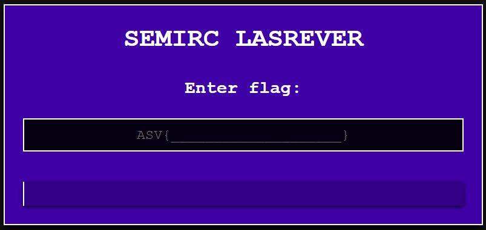
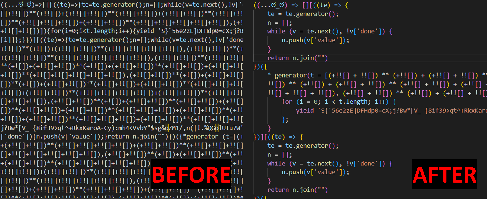

# ASVCTF 2022 - SEMIRC LASREVER Writeup
- Type - Rev
- Name - SEMIRC LASREVER
- Points - 450

## Description
```markdown
Reversing binaries is fun, but have you ever seen a portal that has code so horrible, that its developers let credentials be validated in the frontend? 

No? Well, it's happened! 

This challenge is an example of someone who spent a lot of time hardening said frontend calculation, and your job is to show them the hacker stuff you are made of and find the passcode!
```

## Writeup
From the moment I realized this challenge was reverse engineering JavaScript code instead of assembly, I knew that I'd want first blood on it! Reverse engineering regular code is one of my favorite things to do. We were given a website that had two JS files attached and validated a flag that we put into it.



The first JS file, [f0.js](src/f0.js), added an event listener so that each time the input box for the flag was changed, `!m[0](e.target.value, handler)` was called. The handler function defined just above just showed you whether or not the flag was correct, `m[0]` was the function we needed to reverse engineer, and the first parameter passed in was our flag. `m` is defined in [f0.js](src/f0.js), which was where all our ugly code was. The first thing I did was throw it into a [JavaScript code beautifier](https://beautifier.io/), which made it much nicer for us:



### Part 1
Part 1 was reducing this ugly JS to a function call with more ugly JS. To get there, I took large chunks of the code and ran them individually in the JavaScript web console to see what they returned. For example, running the code:

```javascript
((te) => {
    te = te.generator();
    n = [];
    while (v = te.next(), !v['done']) {
        n.push(v['value']);
    }
    return n.join("")
})({
    * generator(t = [(+!![] + !![]) ** (+!![]) + (+!![] + !![]) ** (+!![] + !![]) + (+!![] + !![]) ** (+!![] + !![] + !![]), (+!![] + !![]) ** (+!![]) + (+!![] + !![]) ** (+!![] + !![]) + (+!![] + !![]) ** (+!![] + !![] + !![]) + (+!![] + !![]) ** (+!![] + !![] + !![] + !![] + !![]), (+!![] + !![]) ** (+!![]) + (+!![] + !![]) ** (+!![] + !![]) + (+!![] + !![]) ** (+!![] + !![] + !![])]) {
        for (i = 0; i < t.length; i++) {
            yield 'S}`56e2zE]DFHdp0=cX;j?Bw*[V_ {8if39>qt^+RkxKaroA-Cy):mh4<VvbY"$sg&оZM1/,n(|!.%QGοlUIu7W' [t[i]]
        };
    }
})
```

gave the output `'pop'`. Running the code inside each of the main 4 square brackets `[]` resulted in the following code:

```javascript
((...ಠ_ಠ) => []['pop']['constructor']('function t(t){_=[15,143,204,345,184,236,141,37,58,157,3,139,67,250,7,153,187,12,67,250,7,153,187,12,210,134,181,51,198,83,113];о=[165,174,189,118,80],ο=[114,175,131,129,217];g=(_1=345,_2=2342,_3=0x1337,_4=0xDEADBEEF)=>{e=(function n(_1,_2,_3,_4){return function(){var t=_2<<9,r=_1*5;r=(r<<7|r>>>25)*9;_3^=_1;_4^=_2;_2^=_3;_1^=_4;_3^=t;_4=_4<<11|_4>>>21;return (r>>>0)/4294967296;};})(_1,_2,_3,_4);e();};return (t=((t)=>{return t.map(t=>{const n=t.toString(16);return 1==n.length?`0${n}`:`${n}`}).join("")})(((t)=>{p=t.filter((_,i)=>i%2==1);q=t.filter((_,i)=>i%2==0);return [...q.slice(0,Math.floor(q.length/2)),...p.slice(Math.floor(p.length/2)).slice().reverse(),...p.slice(0,Math.floor(p.length/2)).slice().concat(p.slice(0,Math.floor(p.length/2))),...q.slice(Math.floor(q.length/2)).slice().reverse()];})(Array(((t)=>{n=[];g(0x3,0o523);_j=()=>Math.round(e()*t.length)%t.length;for(i=0;i<t.length;i++){((()=>{do{j=_j()}while(n[j]!==undefined)})(),n[j]=t[i])};return n;})(((t)=>{n=[];for(e=0;e<t.length;e++){n.push(t.charCodeAt(e));}return n})(t))).map(x=>[x.slice(0,5),x.slice(5,13),x.slice(13,20),x.slice(20,25)].map((curr,idx)=>([0,3].includes(idx)?((t,f)=>{n=[];g(0,parseInt("SYKE",29));for(i=0,j=t.length-1;i<t.length;i++,j--){(_o=[],o_=[],(e()>0.5?(()=>{_o=f?о:ο;o_=f?ο:о})():(()=>{o_=о;_o=ο})()),n[j]=t[i]^_o[o_[Math.round(e()*o_.length+1)%o_.length]%_o.length]);}return n;})(curr,idx==0):[null,(t)=>{g();n=[];for(j=0;j<t.length;j++){n[t.length-j-1]=t[j]^Math.round(e()*256);}return n;},(t)=>{n=[];i=0;for(e=0;e<t.length;e++){n.push((((e%4==0?t[e]-[...о,...ο][i++%[...о,...ο].length]:e%4==1?t[e]:e%4==2?t[e]+[...о,...ο][i++%[...о,...ο].length]:t[e]^[...о,...ο][i--%[...о,...ο].length])%256)+256)%256);}return n}, null][idx](curr))))[0].flat())))==((t)=>{return t.map(t=>{const n=t.toString(16);return 1==n.length?`0${n}`:`${n}`}).join("")})(_)};const c=(n,e)=>{if(document.getElementById("WW91IHRob3VnaHQgdGhlIGZsYWcgd2FzIGhlcmU/IFRoYXQncyBwcmV0dHkgY3V0ZSEgU2FkbHkgbm8sIHlvdXIgZmxhZyBpcyBpbiBhbm90aGVyIGZpbGUh")&&n.length%5==0){if(t(n)) return e({status:!0,flag:n}),!0}else e({status:!1});return !1;};this[0][0]=c;')['call'](ಠ_ಠ))(m)
```

I isolated the large chunk of code inside the string and ran it through a beautifier again, resulting in [part2.js](part2.js)

### Part 2
Part 2 has 3 main code blocks:

```javascript
function t(t) {
    ...
};

const c = (n, e) => {
    ...
};

this[0][0] = c;
```

The third section with the `this` variable is how running `!m[0](e.target.value, handler)` from f0.js ran the `c()` function, with `n` as the inputted flag to verify and `e` as the handler function. The second section (function `c`) was pretty boring except for two parts - first, the call to `t(n)` on line 85 showed that the inputted flag was sent as the parameter to the `t()` function. Secondly, line 84 shows that `n.length % 5 == 0`, meaning that the flag length is a multiple of 5! So we now know *something* about the flag, and we know that the function `t()` will return `True` if the flag is correct, and `False` if it's not. We're getting close!

### Part 2.5
Function `t()` is the ugliest code so far and ties a bit into cryptography with a custom PRNG represented by `e()` and like a four-part "decryption" process going on. I tried to break it down a bit and came across a huge breakthrough. The return statement for the function `t()` spanned lines 21-80, and it was just a boolean check `expression1 == expression2`. `Expression1` went from lines 21-75, and `Expression2` was lines 75-80. Wanting to know what the "correct" value was going to be, I threw lines 75-80 into the console:

```javascript
// hard coded values from line 2
_ = [15, 143, 204, 345, 184, 236, 141, 37, 58, 157, 3, 139, 67, 250, 7, 153, 187, 12, 67, 250, 7, 153, 187, 12, 210, 134, 181, 51, 198, 83, 113];

// expression 2
((t) => {
        return t.map(t => {
            const n = t.toString(16);
            return 1 == n.length ? `0${n}` : `${n}`
        }).join("")
    })(_)
```

The result? `0f8fcc159b8ec8d253a9d038b43fa0799bb0c43fa0799bb0cd286b533c65371`

We now had a 63-character long hard-coded value that we needed to match after the "encryption" process. This is when I decided to switch over to dynamic analysis instead of static analysis. Instead of going through the code line by line, I could put in various values and test how the output changed. As another quick side note, line 48 broke up part of the encrypted text into sections, and the substrings went up to 25 - since the flag length was divisible by 5, I knew the flag had to be 25 characters long. 

For my dynamic testing, I created [solve.js](solve.js) where I placed a slightly modified version of the `t()` function in along with various flag payloads I could test and see the output. My baseline was `aaaaaaaaaaaaaaaaaaaaaaaaa` (25 * `a`), and this returned `31b8e01619dccb8131eb30fbc13c42fbc855e13c42fbc855ee0b8e061dc6124`. I then tried the payloads `baaaaaaaaaaaaaaaaaaaaaaaa` and `caaaaaaaaaaaaaaaaaaaaaaaa` and got returned the values `31b8e01619dcfb8131eb30fbc13c42fbc855e13c42fbc855ee0b8e061dc6124` and `31b8e01619dceb8131eb30fbc13c42fbc855e13c42fbc855ee0b8e061dc6124`, respectively. At first glance, those next 2 results look the same, but in actuality the 13th character was different. I then tried the payload `abaaaaaaaaaaaaaaaaaaaaaaa`, which gave me `31b8e01619dccb8131eb30fbc13c42fbc855e13c42fbc855ee0b8e061dc6224`. Now that `a` was the first letter of the flag again, the 13th letter was the same. However, `b` as the second letter changed the 3rd-to-last character from `1` to `2`. At this point, I concluded that there was a one-to-many relationship between characters in the flag and outputted characters. This meant that I could brute force the flag letter by letter since the value of one character didn't affect the output of any other parts of the encrypted output. 

To establish which letter of the flag corresponded with which characters in the output, I used my base payload of `aaaaaaaaaaaaaaaaaaaaaaaaa` with `b`s in all the different positions. This was my output:

```
(baseline)
aaaaaaaaaaaaaaaaaaaaaaaaa - 31b8e01619dccb8131eb30fbc13c42fbc855e13c42fbc855ee0b8e061dc6124

(variations)
baaaaaaaaaaaaaaaaaaaaaaaa - 31b8e01619dcfb8131eb30fbc13c42fbc855e13c42fbc855ee0b8e061dc6124
                                       ^^
abaaaaaaaaaaaaaaaaaaaaaaa - 31b8e01619dccb8131eb30fbc13c42fbc855e13c42fbc855ee0b8e061dc6224
                                                                                       ^^
aabaaaaaaaaaaaaaaaaaaaaaa - 31bbe01619dccb8131eb30fbc13c42fbc855e13c42fbc855ee0b8e061dc6124
                              ^^
aaabaaaaaaaaaaaaaaaaaaaaa - 31b8e01619dccb8131eb30fbc13c42fbc855e13c42fbc855ee0b8e061df6124
                                                                                     ^^
aaaabaaaaaaaaaaaaaaaaaaaa - 31b8e01619dccb8131eb30fbc13c42fbf855e13c42fbf855ee0b8e061dc6124
                                                           ^^          ^^
aaaaabaaaaaaaaaaaaaaaaaaa - 31b8e01619dccb8131eb30fbc10c42fbc855e10c42fbc855ee0b8e061dc6124
                                                     ^^          ^^
aaaaaabaaaaaaaaaaaaaaaaaa - 31b8e01619eccb8131eb30fbc13c42fbc855e13c42fbc855ee0b8e061dc6124
                                     ^^
aaaaaaabaaaaaaaaaaaaaaaaa - 32b8e01619dccb8131eb30fbc13c42fbc855e13c42fbc855ee0b8e061dc6124
                            ^^
aaaaaaaabaaaaaaaaaaaaaaaa - 31b8e01619dccb8131eb30fbc13c42cbc855e13c42cbc855ee0b8e061dc6124
                                                         ^^          ^^
aaaaaaaaabaaaaaaaaaaaaaaa - 31b8e01619dccb8131eb30fbc13c72fbc855e13c72fbc855ee0b8e061dc6124
                                                       ^^          ^^
aaaaaaaaaabaaaaaaaaaaaaaa - 31b8e31619dccb8131eb30fbc13c42fbc855e13c42fbc855ee0b8e061dc6124
                                 ^^
aaaaaaaaaaabaaaaaaaaaaaaa - 31b8e01619dccb8131eb30fbc13c42fbc855e13c42fbc855ee0b8e061dc6127
                                                                                         ^^
aaaaaaaaaaaabaaaaaaaaaaaa - 31b8e01619dccb8131eb40fbc13c42fbc855e13c42fbc855ee0b8e061dc6124
                                               ^^
aaaaaaaaaaaaabaaaaaaaaaaa - 31b8e01619dccb8131eb30fbc13c42fbc855e13c42fbc855ee0b8e062dc6124
                                                                                   ^^
aaaaaaaaaaaaaabaaaaaaaaaa - 31b8e01619dccb8131eb30fbc13c42fbc855e13c42fbc855ee0bbe061dc6124
                                                                               ^^
aaaaaaaaaaaaaaabaaaaaaaaa - 31b8e01629dccb8131eb30fbc13c42fbc855e13c42fbc855ee0b8e061dc6124
                                   ^^
aaaaaaaaaaaaaaaabaaaaaaaa - 31b8e01619dccb8131eb30fbd13c42fbc855e13c42fbc855ee0b8e061dc6124
                                                   ^^
aaaaaaaaaaaaaaaaabaaaaaaa - 31b8e01619dccb8131eb310bc13c42fbc855e13c42fbc855ee0b8e061dc6124
                                                 ^^
aaaaaaaaaaaaaaaaaabaaaaaa - 31b8e01619dccb8131eb30fbc13c42fbc865e13c42fbc865ee0b8e061dc6124
                                                             ^^          ^^
aaaaaaaaaaaaaaaaaaabaaaaa - 31b8e01619dccb8131eb30fbc13c42fbc855e13c42fbc855ee3b8e061dc6124
                                                                             ^^
aaaaaaaaaaaaaaaaaaaabaaaa - 31b8e01619dccb8101eb30fbc13c42fbc855e13c42fbc855ee0b8e061dc6124
                                           ^^
aaaaaaaaaaaaaaaaaaaaabaaa - 31b8e01619dccb8131eb30fbc13c42fbc855d13c42fbc855de0b8e061dc6124
                                                               ^^          ^^
aaaaaaaaaaaaaaaaaaaaaabaa - 31b8e01619dccb8131eb30fbc13c42fbc855e13c42fbc855ee0b8e361dc6124
                                                                                 ^^
aaaaaaaaaaaaaaaaaaaaaaaba - 31b8e01619dccbb131eb30fbc13c42fbc855e13c42fbc855ee0b8e061dc6124
                                         ^^
aaaaaaaaaaaaaaaaaaaaaaaab - 31b8e01619dccb8131fb30fbc13c42fbc855e13c42fbc855ee0b8e061dc6124
                                             ^^
```

Notice that some characters in the flag map to 4 outputted characters and not always 2, but that didn't change anything about my solution. At this point, I was just like "Since I know that the first character of the flag affects the 12th and 13th outputted characters, I will try all possible printable characters for the first letter of the flag until the 12th and 13th letters of the output match our hard-coded answer". 

For example, even though we know that `A` is the first letter because the flag format is `ASV{}`, I could brute force the first letter and get `Aaaaaaaaaaaaaaaaaaaaaaaaa` with this code:

```javascript
let alphabet = "ABCDEFGHIJKLMNOPQRSTUVWXYZabcdefghijklmnopqrstuvwxyz0123456789{}_";
let answer = "0f8fcc159b8ec8d253a9d038b43fa0799bb0c43fa0799bb0cd286b533c65371"

for (let i = 0; i < alphabet.length; i++) {
    let payload = alphabet[i]+"aaaaaaaaaaaaaaaaaaaaaaaa";
    result = t(payload);
    if (result.substring(11,13) == answer.substring(11,13)) {
        console.log(payload);
        break;
    }
}
```

### Final Solve Script
```javascript
function t(t) {...}
let modified = [11, 59, 2, 57, 31, 25, 9, 0, 29, 27, 5, 61, 19, 55, 51, 7, 23, 21, 33, 49, 15, 35, 53, 13, 17];
let alphabet = "ABCDEFGHIJKLMNOPQRSTUVWXYZabcdefghijklmnopqrstuvwxyz0123456789{}_";
let answer = "0f8fcc159b8ec8d253a9d038b43fa0799bb0c43fa0799bb0cd286b533c65371";

flag = [];
for (let i = 0; i < modified.length; i++) {

    for (let j = 0; j < alphabet.length; j++) {
        let payload = "a".repeat(i)+alphabet[j]+"a".repeat(24-i);
        result = t(payload);

        if (result.substring(modified[i],modified[i]+2) == answer.substring(modified[i],modified[i]+2)) {
            flag.push(alphabet[j]);
            break;
        }
    }

    console.log(flag.join(""));
}
```

**Flag:** `ASV{D1D_I_M4K3_Y0U_SW34T}`