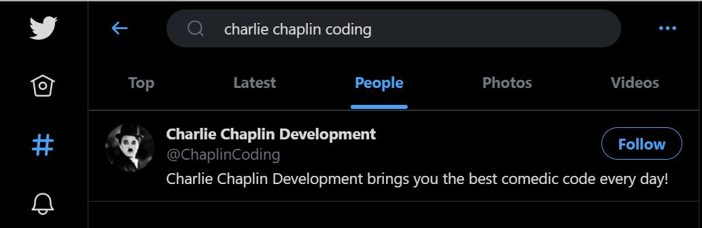
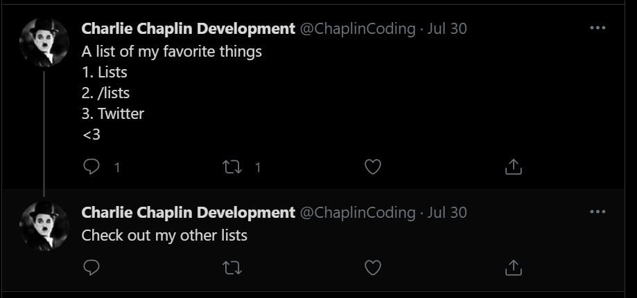
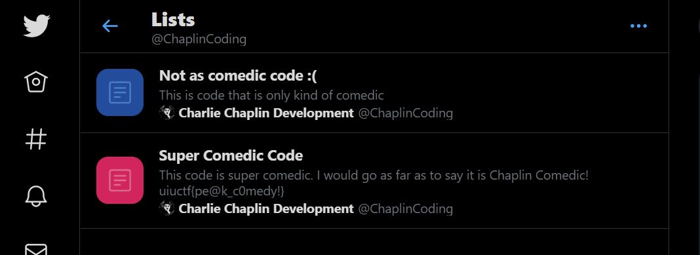
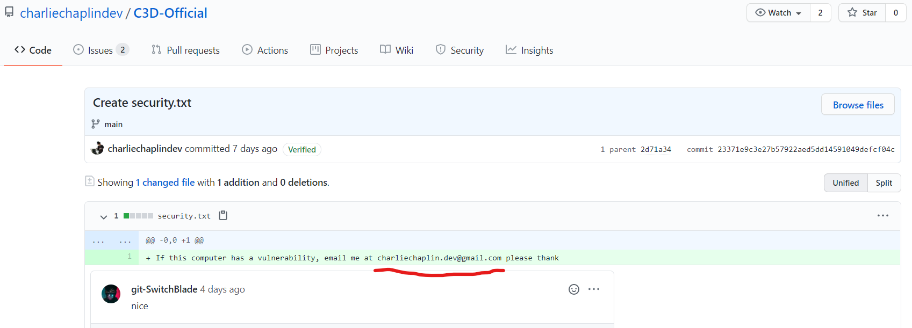
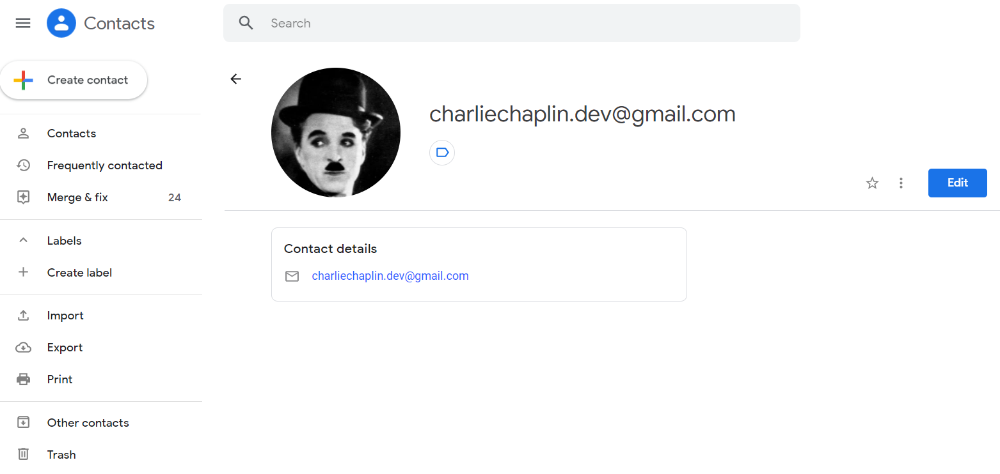
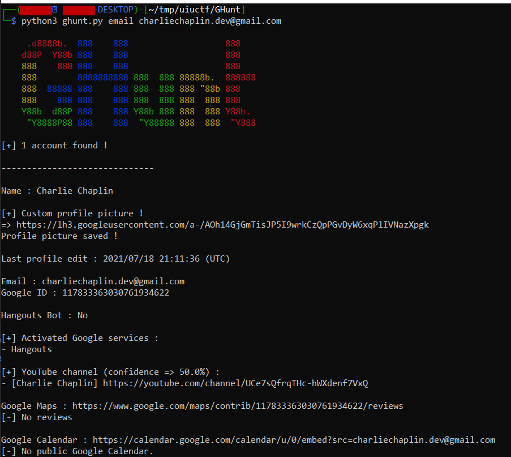
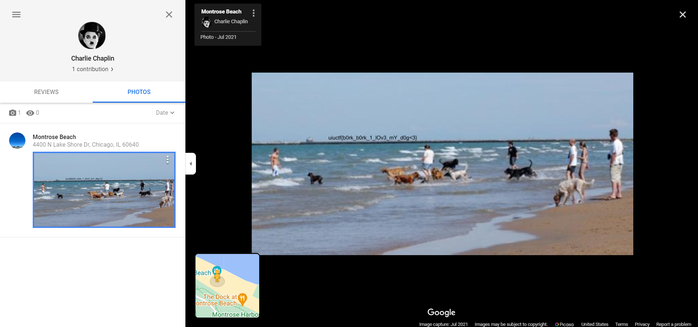

# UIUCTF 2021- Chaplin's PR Nightmare 1-8 Writeups
* Type - OSINT
* Points - 50 for 1-7, 88 for 8

## Chaplin's PR Nightmare - 1
### Description
```
Charlie Chaplin has gotten into software development, coding, and the like... 
He made a company, but it recently came under fire for a PR disaster. 
He got all over the internet before he realized the company's mistake, 
and is now scrambling to clean up his mess, but it may be too late!! 
Find his Twitter Account and investigate! NOTE THAT THESE CHALLENGES DO NOT 
HAVE DO BE DONE IN ORDER!

The inner content of this flag begins with "pe"

author: Thomas
```

### Writeup
Starting off with the first challenge, we are given a few key pieces of information. First of all, a full name. Next we also have key words such as coding, Software development etc.. These are good to use to modify search parameters to vary a search until the desired result is found. 

Thankfully, since they've given us information, and a platform to look on, this should be pretty straight forward. Going to Twitter, we can use the search function and start plugging in the combinations we have. One thing with Twitter searches and other search engines in general, is to sort by the type of content you're looking for to begin with. For this challenege, that would be a profile, instead of a specific tweet or hashtag or trending topic. 



So as the above image shows, "charlie chaplin coding" brings up a solitary account - this looks like it. Further investigation leads to a few couple things. First off, there's a YouTube link, which will lead us straight to the next challenge. After looking at a few of the tweets, we can see that he has one thread dedicated to "lists". Any Twitter user who's used it for long enough will know that Twitter users have the abillity to create their own "lists", mostly containing users they select for some reason. 




Now once we open that we are rewarded with a flag right away. Not too bad, but definitely a good place to hide a flag! A common trend among these challenges is that they show off side features of platforms that require a step or two to discover. 




**Flag:** `uiuctf{}`

### Real-World Application
Put RWA here

## Chaplin's PR Nightmare - 2
### Description
```
Description
```

### Writeup
Put writeup here

**Flag:** `uiuctf{}`

### Real-World Application
Put RWA here

## Chaplin's PR Nightmare - 3
### Description
```
Description
```

### Writeup
Put writeup here

**Flag:** `uiuctf{}`

### Real-World Application
Put RWA here

## Chaplin's PR Nightmare - 4
### Description
```
Description
```

### Writeup
Put writeup here

**Flag:** `uiuctf{}`

### Real-World Application
Put RWA here

## Chaplin's PR Nightmare - 5
### Description
```
Description
```

### Writeup
Put writeup here

**Flag:** `uiuctf{}`

### Real-World Application
Put RWA here

## Chaplin's PR Nightmare - 6
### Description
```
Description
```

### Writeup
Put writeup here

**Flag:** `uiuctf{}`

### Real-World Application
Put RWA here

## Chaplin's PR Nightmare - 7
### Description
```
Description
```

### Writeup
Put writeup here

**Flag:** `uiuctf{}`

### Real-World Application
Put RWA here


## Chaplin's PR Nightmare - 8 (Extreme)
### Description
```
Straightup doxx Charlie by finding the email he set all these accounts up
with, and investigate it.

The inner content of this flag begins with "b0"

author: Thomas

> Hint: This challenge was inspired by something previous.
```

### Writeup
The first step before doing anything else is finding the email. One trick for finding sensitive information in GitHub repos is looking at previous commits - if someone puts sensitive information and then rewrites it, you can access all that info by looking at the history. We had already found [Chaplin's GitHub here](https://github.com/charliechaplindev?tab=repositories), so it was a matter of looking around. While looking through the C3D-Official repository commits, we find an email address [in the commit titled "Create security.txt"](https://github.com/charliechaplindev/C3D-Official/commit/23371e9c3e27b57922aed5dd14591049defcf04c). Perfect!



Since it's a Google account, I figured there would be a lot of information about the account that I could see. I opened him in Google Contacts online, but there didn't seem to be anything on there, except a profile picture. I downloaded the photo and ran exiftool on it and such. I didn't find anything particularly useful, and was going to go full steg mode on it until I decided to see what his account connected with first. 



I looked back at the description and decided to do a little digging based on the hint, "This challenge was inspired by something previous". My teammate had already looked around on all the other sites and social media that he was attached to and couldn't find anything, so I decided to look at some of the writeups for OSINT challenges from last year. In [a writeup for "Isabelle's Bad Opsec 4" by IrisSec](https://ctftime.org/writeup/22685), skat talked about a rabbit hole he went down while searching for the answer - going after the person's Google ID. He explained the implications could include seeing Google Maps reviews, and even put `This might make for an interesting future challenge if any potential CTF organizers are reading this (hint hint, nudge nudge).` This just seemed to align too perfectly!

I did a Google search for how to connect Gmail accounts to other accounts and came across [GHunt](https://github.com/mxrch/GHunt). GHunt is a GitHub repository that uses your local Gmail account cookies to find information about a Gmail address, including:

* Owner's name
* Last time the profile was edited
* Profile picture (+ detect custom picture)
* Activated Google services (YouTube, Photos, Maps, News360, Hangouts, etc.)
* Possible YouTube channel
* Google Maps reviews (M)
* Possible physical location (M)
* Events from Google Calendar (C)
* and more!

I cloned the repository, had to install Chrome (since I was on WSL and it kept breaking because it couldn't locate Chrome in the file system), then put the 5 cookies from a fake Google account I set up to run it. 



As you can see above, we were given a link to his profile picture (which I already had), a YouTube channel, a Google Maps account, and a Google Calendar. The YouTube channel ended up being a popular Charlie Chaplin channel with millions of subscribers, so I knew it wasn't right. The Google Calendar (supposedly) didn't have any public events, and even though there were no reviews for Google Maps, I went to the link anyway. 

When you [open the link](https://www.google.com/maps/contrib/117833363030761934622/reviews), you can see Charlie Chaplin has 1 contribution. When you click on photos and open it up, you can see a photo was added in Montrose Beach in Chicago, IL with a flag on it!



**Flag:** `uiuctf{b0rk_b0rk_1_lOv3_mY_d0g<3}`

### Real-World Application
I think this challenge is a prime example of how one account can link you to other places that you may not suspect. Since this account was fake and set up simply for the purposes of linking to Google Maps reviews, there wasn't much information to see. However, seeing the list of what GHunt can link to you with simply one email can be quite scary - any linked Google services, location history, current location, your calendar, etc. This shows you some of the possible dangers of using a Google account, and some of the avenues to track someone down through OSINT. 

Another lesson to learn from this is more CTF-specific, but looking at writeups from previous iterations of a CTF can give you a good insight into how the CTF is run, what types of challenges they may have, and even specific methods that organizers will use from CTF to CTF. The writeup by IrisSec that we've linked to above cracked open the whole case!