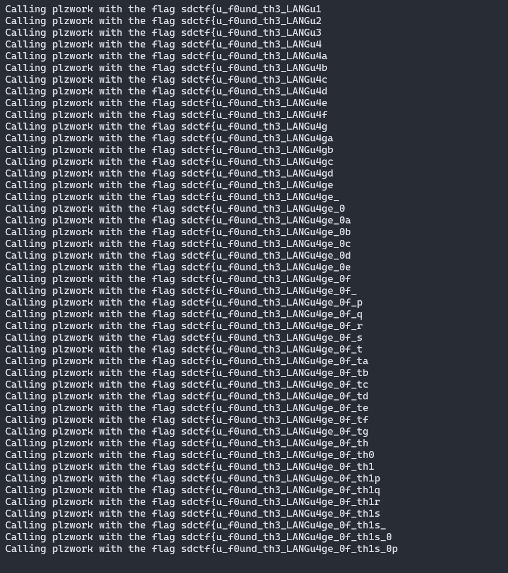

# Curl Up and Read
**Category**: Oracle

**Level**: Easy

**Points**: 130

**Description**:
```markdown
An oracle is a black box in a Turing machine. You can run it but how do you inspect it?

[Oracle.class]
```

## Writeup
This challenge was really enjoyable and although I bet I solved it in a way different from everyone else, it worked! The first step was to decompile the Java `class` file into something more readable. Using [an online Java decompiler](http://www.javadecompilers.com/result), I was able to create the `flag.java` file, which was very readable:

```java
import java.io.Console;

public class Oracle {
  private static final int FLAG_LENGTH = 42;
  
  private static final byte[] CHECK = new byte[] { 
      48, 6, 122, -86, -73, -59, 78, 84, 105, -119, 
      -36, -118, 70, 17, 101, -85, 55, -38, -91, 32, 
      -18, -107, 53, 99, -74, 67, 89, 120, -41, 122, 
      -100, -70, 34, -111, 21, Byte.MIN_VALUE, 78, 27, 123, -103, 
      36, 87 };
  
  private static byte[] numbers;
  
  private static void firstPass() {
    for (byte b = 0; b < 42; b++)
      numbers[b] = (byte)(numbers[b] ^ 3 * b * b + 5 * b + 101 + b % 2); 
  }
  
  private static void secondPass() {
    byte[] arrayOfByte = new byte[42];
    for (byte b = 0; b < 42; b++)
      arrayOfByte[b] = (byte)(numbers[(b + 42 - 1) % 42] << 4 | (numbers[b] & 0xFF) >> 4); 
    numbers = arrayOfByte;
  }
  
  private static void thirdPass() {
    for (byte b = 0; b < 42; b++)
      numbers[b] = (byte)(numbers[b] + 7 * b * b + 31 * b + 127 + b % 2); 
  }
  
  private static void fail() {
    System.out.println("\nThat's not the flag. Try again.");
    System.exit(1);
  }
  
  public static void main(String[] paramArrayOfString) {
    Console console = System.console();
    numbers = console.readLine("Enter flag: ", new Object[0]).getBytes();
    if (numbers.length != 42)
      fail(); 
    firstPass();
    secondPass();
    thirdPass();
    int i = 0;
    for (byte b = 0; b < 42; b++) {
      i |= CHECK[b] ^ numbers[b]; 
    }
    if (i != 0)
      fail(); 
    System.out.println("\nGood job. You found the flag!");
  }
}
```

The code was well-labeled, so it didn't take too long to understand what was happening. I knew the flag was 42 characters long (35 minus the `sdctf{}`). It was being validated by running the characters through three functions that did a bunch of math stuff to it and compared it to the `CHECK` array at the end. Instead of trying to reverse the math and making some really ugly code, I decided it would be easier (and cooler-looking) to brute force it character by character.

The three functions looped through each character in the inputted string, modified the character, stored it in the `numbers` array, and the CHECK array stored what the end result should be for each character in order. So, I added a print statement in the loop where the inputted string was compared to `CHECK` that printed out each number in the `numbers` array so I could see if the character I had inputted was successful or not. I also modified the code slightly so that the inputted flag came through as an argument instead of typed in. The main function then looked like this:

```java
public static void main(String[] paramArrayOfString) {
    Console console = System.console();
    //numbers = console.readLine("Enter flag: ", new Object[0]).getBytes();
    numbers = paramArrayOfString[0].getBytes(); // gets flag through a command line argument
    if (numbers.length != 42)
      fail(); 
    firstPass();
    secondPass();
    thirdPass();
    int i = 0;
    for (byte b = 0; b < 42; b++) {
      System.out.print(numbers[b]+" "); // prints out each letter in the numbers[] array
      i |= CHECK[b] ^ numbers[b]; 
    }
    if (i != 0)
      fail(); 
    System.out.println("\nGood job. You found the flag!");
  }
```

I then wrote a Python script that ran the Java code, captured the output, and determined if the character I inserted into the flag was valid or not by comparing it to the `CHECK` array that I imported into my script. If the character wasn't valid, I went on to the next one and repeated the process. My code is below:

```python
import subprocess

flag = "sdctf{"
characters = "_abcdefghijklmnopqrstuvwxyzABCDEFGHIJKLMNOPQRSTUVWXYZ0123456789-"
answer = [48, 6, 122, -86, -73, -59, 78, 84, 105, -119, -36, -118, 70, 17, 101, -85, 55, -38, -91, 32, -18, -107, 53, 99, -74, 67, 89, 120, -41, 122, -100, -70, 34, -111, 21, -128, 78, 27, 123, -103, 36, 87]

def plzwork(flag_temp):
    print("Calling plzwork with the flag "+flag_temp)
    for char in characters:
        # get result
        process = subprocess.Popen(['java', 'flag.java', flag_temp+char+('a'*(40-len(flag_temp)))+"}"], stdout=subprocess.PIPE, stderr=subprocess.PIPE)
        out, err = process.communicate()
        result = out.decode("utf-8").split("\n")[0].split(" ")[:-1]

        # checking
        same = True
        for i in range(len(flag_temp)+1):
            if int(result[i]) != answer[i]:
                same = False

        if same:
            plzwork(flag_temp+char)

for _ in range(35):
    plzwork(flag)
```

One problem I ran into was that there were *multiple* characters that returned valid in a specific position. For example, putting the flag `sdctf{qaaaaaaaaaaaaaaaaaaaaaaaaaaaaaaaaaa}` revealed that the first 7 characters (`sdctf{q`) were valid, but so were `sdctf{p`, `sdctf{r`, `sdctf{s`, etc. However, if I assumed that `sdctf{q` was correct and tried to find the 8th character in the flag, none of them returned true. To fix this, I changed my script so it ran recursively, meaning that it would assume `sdctf{q` was correct and try to brute force the second character. If nothing came back valid, it would go back to the previous function call and try it with `sdctf{p` and so on until one of them worked. This trial-and-error process ended up taking a lot longer than I expected it to, but I got the flag about an hour later.



**Flag** - `sdctf{u_f0und_th3_LANGu4ge_0f_th1s_0r4cl3}`