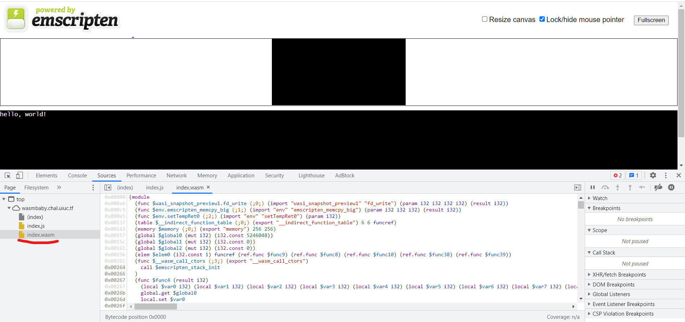
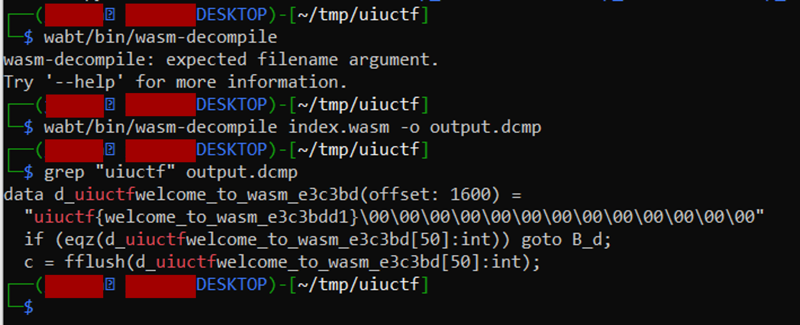

# UIUCTF 2021 - Wasmbaby (Beginner) Writeup
* Type - Web
* Name - Wasmbaby
* Points - 50

## Description
```
wasm's a cool new technology! http://wasmbaby.chal.uiuc.tf

author: ian5v
```

## Writeup
"Wasm" stands for [WebAssembly](https://developer.mozilla.org/en-US/docs/WebAssembly), a low-level language that allows you to run non-web files on a web browser. For example, if you wanted to run a C++ or Rust file in your web browser, you can convert it into WebAssembly and integrate it into your website through JavaScript. More details about WebAssembly can be found [here](https://webassembly.org/). 



To download a wasm file for local editing, you can open the console, go to Sources, and you'll find the .wasm file. If you right click on the underlined portion shown above and select "Open in a New Tab", it will download the .wasm file for you since it can't properly display it by itself in the browser. 

Now that we have this binary file, we want to convert it to a more readable format so we can understand what it's supposed to do. There's a GitHub repository that WebAssembly maintains called [WebAssembly Binary Toolkit](https://github.com/WebAssembly/wabt) that allows you to convert and manipulate WebAssembly files. I cloned the repository and went through the steps described to install all the files. `wasm-decompile` is a program that turns a .wasm file into a much more readable format. I used the commands below to turn index.wasm into a .dcmp file. 



I then used grep to see if the flag was in plaintext, which it was! Luckily, I didn't have to go and inspect the program any closer!

**Flag:** `uiuctf{welcome_to_wasm_e3c3bdd1}`

## Real-World Application
While Wasm has huge benefits (allowing computationally-heavy tasks to be optimized much more), it's not very widespread in application. Why is that? [One article hypothesizes](https://blog.bitsrc.io/whats-wrong-with-web-assembly-3b9abb671ec2) that the lack of marketing is the reason why it's not used as much. It *is* used by Unity, Google Earth, AutoCAD, and other big projects, but it still has so much untapped potential. 

So how is this important in the real world? History has shown that security almost always comes *after* something is designed and becomes big. The Internet was never designed with security in mind; SSL/TLS versions of almost all procotols came after the initial protocol was created and widespread. I would be willing to bet that Wasm, unless we change it, will follow the same pattern. It's important that we realize the security implications of Wasm *before* it becomes big so we can get ahead of the curve! 

This challenge had the flag in plaintext in the wasm file. While most people aren't too familiar with Wasm, it doesn't take much work to figure out how to access and download the file to extract credentials. Security through obscurity is not security.