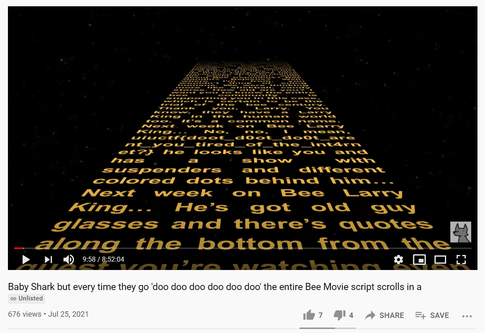

# UIUCTF 2021 - Doot Doot (Beginner) Writeup
* Type - Miscellaneous
* Name - Doot Doot
* Points - 50

## Description
```
From the creator of "Shrek but only when ANYONE says 'E'", we bring you the most-viewed-YouTube 
video of all time: https://en.wikipedia.org/wiki/List_of_most-viewed_YouTube_videos#Top_videos 
https://www.youtube.com/watch?v=zNXl9fqGX40

author: GrayWalf and ian5v
```

## Writeup
When you go to the link, one of the comments says `the flag is in the yellow text, and occurs once in every instance of the yellow text`. The video was almost 9 hours total in length, but I knew I'd only have to scour one instance of the yellow text. I considered various ways of approaching it, including integrating some OCR (Optical Character Recognition) program in YouTube and have it tell me all the text so I could do a simple grep search. However, the rolling text was Star Wars-style (so slanted), plus I wasn't quite sure how to integrate it, so I just went for it. Luckily, I found the text about 10 minutes in!



**Flag:** `uiuctf{doot_d0ot_do0t_arent_you_tired_of_the_int4rnet?}`

## Real-World Application
I think the biggest real-world application for this is that sometimes, nothing beats just grinding. I could've found a way to integrate OCR into it and automate the process, but it honestly was much quicker watching the video and skipping every 5 seconds.