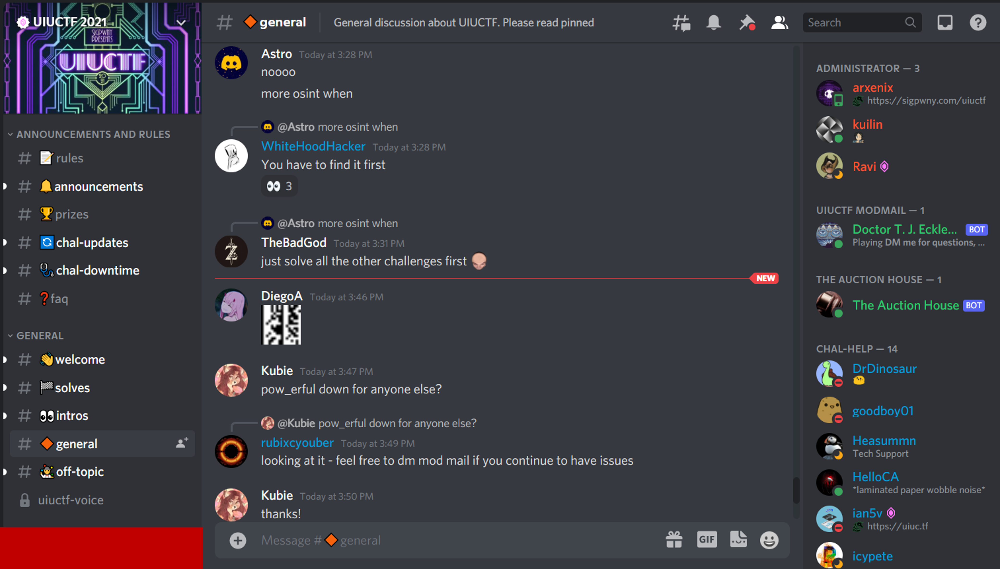
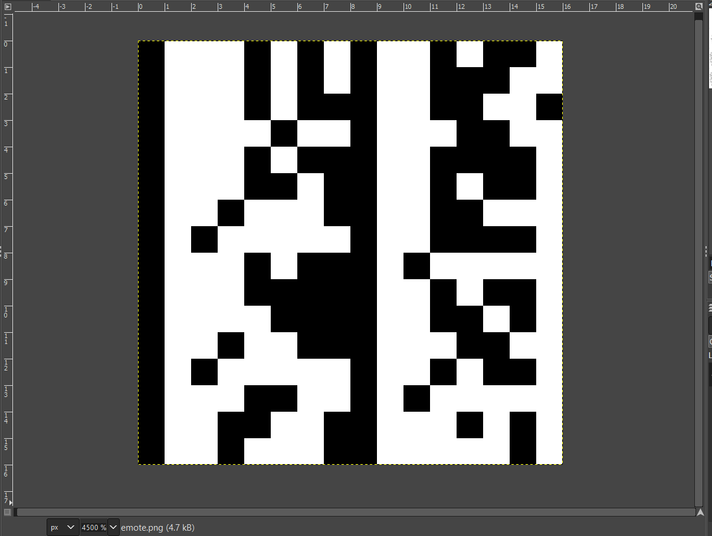
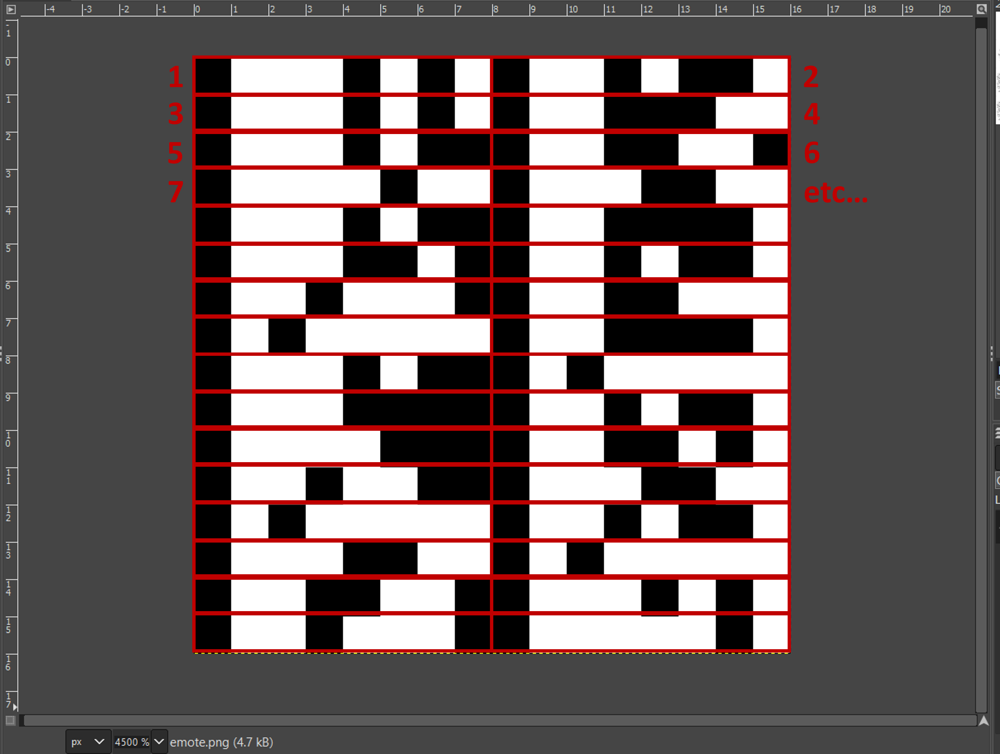

# UIUCTF 2021 - Emote (Beginner) Writeup
* Type - Miscellaneous
* Name - Emote
* Points - 50

## Description
```
recently i've been converting strings into images for funsies and staring at them. anytime time to go share those images with my friends in discord! warning: staring at noise in visual form may or may not introduce you to the abyss

author: ian5v
```

## Writeup
The first clue as to what to look for is ian's comment about Discord! Then, once you hop into any major channel, you'll see an encoded image posted all over the place (see below).



If you right click on the image, you can save it. When you open it up, you'll see a 16 pixel x 16 pixel image of black and white squares. My first thought was that it was some sort of QR code challenge (trust me, I've decoded a QR code by hand before and it is not something I would fancy doing again!), but there just seemed to be too few pixels for that.



As I kept studying it, I realized that the image was split vertically into two even halves, and each half had one black, vertical strip, followed by a white, vertical strip. I suddenly remembered that ASCII characters usually start with `01`, and realized it was probably just a picture of binary characters, two-wide. So each vertical row contains two ASCII characters encoded in binary!



You can use a program [like dcode's](https://www.dcode.fr/binary-image) to convert the image to binary, and then convert the binary to ASCII and voila! You'll get the flag!

**Flag:** `uiuctf{staring_at_pixels_is_fun}`

## Real-World Application
It's important to become familiar with all types of encoding and being able to recognize binary and ASCII characters makes things so much more efficient!