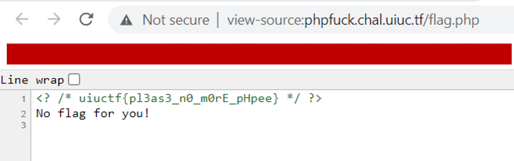

# UIUCTF 2021 - PHPFudge (Beginner) Writeup
* Type - Jail
* Name - PHPFudge
* Points - 50

## Description
```
i hate php

http://phpfuck.chal.uiuc.tf

author: arxenix
```

## Writeup
This was a fairly simple challenge to complete. When you navigate to the URL in the description, the page you'll see has this text followed by the output of phpinfo():

```
<?php
// Flag is inside ./flag.php :)
($x=str_replace("`","",strval($_REQUEST["x"])))&&strlen(count_chars($x,3))<=5?print(eval("return $x;")):show_source(__FILE__)&&phpinfo();
```

So, I followed the advice of the comment, went to /flag.php, and when you look at the source code, you find the flag!



**Flag:** `uiuctf{pl3as3_n0_m0rE_pHpee}`