# UIUCTF 2021 - pwnies_please Writeup

- Type - Misc
- Name - pwnies_please
- Points - 390

## Description

> Disguise these pwnies to get the flag!
>
> http://pwnies-please.chal.uiuc.tf
>
> note: first solve gets $100 from ian (unintended solves don't count)
>
> author: Anusha Ghosh, Akshunna Vaishnav, ian5v, Vanilla

## Writeup

We are given a website, of which we can see the frontend. Very simple. The prompt gives us a pwny, asks us to give it a costume without overdoing it, and tells us to sneak it past the bouncer.

We also have a picture of a pwny (example shown below), and a file upload. We're given a status bar below that, and links to a machine-learning model and the backend source code.

### Review of the Source Code

[The source code](./web.py) shows us the brains behind the site. It shows us we have five minutes until the session becomes reset, and in that time, we need to successfully pass 50 pwnies through. We also have an allowable hash difference of 5 (more on this later).

We have two models loaded in: Nonrobust, and Robust. These both make predictions on a 224x224 image with 3 layers, 8 bits of color in each channel, as to what the image is, including plane, car, bird, cat, deer, dog, frog, horse, ship, and truck.

We were given [the data for Nonrobust](./models/pwny_cifar_eps_0.pth), so we can run that one if we need.

These two models decide how good our mask is. If Robust (the ground truth) thinks our picture isn't a horse, it's worth no points. Otherwise, if Nonrobust (the bouncer) thinks what we have is a horse, we get a point, and if Nonrobust thinks what we have isn't a horse, we get no points. On each failure, our counter increases, and if that counter goes over 3, we have to start all over again.

On top of this, the hash of the input image is compared to the hash of the original image, and if more than 5 of the 32 hex digits of the hash have chaned, both Robust and Nonrobust will claim the image is `"TOO DIFFERENT"` and it counts as a failure.

To recap:

- We need to take the image they gave us
- We need to modify the image, and give it back
- We can't change the original image too much
- One model must think the image is not a horse
- The other model must think the image is a horse
- This gives us one point
- We need 50 points ...
- ... in 5 minutes.
- That's one pwny every 6 seconds.

### Naïve Approach

Knowing all this, let's try something very dumb! Using GIMP, we'll draw just a bit on our pwnies. Here's some of the attempts:

|Image given               |Image with mask         |
|--------------------------|------------------------|
|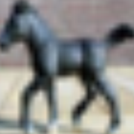 |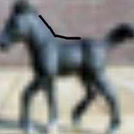 |
|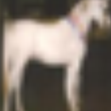 |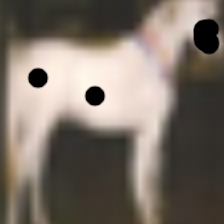 |
|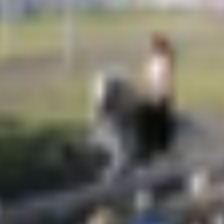|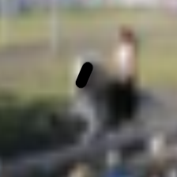|

All in all, I tried 20 of these. Not one of these worked. Sometimes the model would say it was still a horse, mostly it would say the image had changed too much, and my favorite was the last pair shown, for which both models claimed it was an image of a bird.

### Script it up!

Obviously our method is too slow. (It has a lot of problems, okay?) Let's speed it up with Python.

```python
import os
from PIL import Image, ImageDraw

filename = "./index.png"
modified = Image.open(os.path.expanduser(filename))
draw_mod = ImageDraw.Draw(modified)
draw_mod.line([(112, 112), (113, 113)], fill=0)

modified.save(os.path.expanduser(filename.replace('index', 'pwn')))
```

|Image given               |Image with mask         |
|--------------------------|------------------------|
||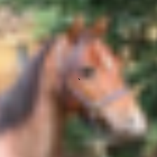|
||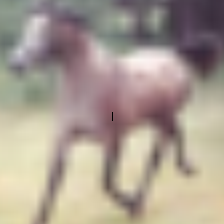|

All in all, I tried 10 of these. This method is fast and consistent. And terrible. I had a few tries at this (with different drawing styles as shown), but it was even worse than the "by hand" method. A lot more `"NO HORSEPLAY"` (looks like a horse). A lot less `"TOO DIFFERENT"`, though.

### Making Better Horse Masks

What we can do instead is make changes in many different places, and as long as it doesn't cross that `"TOO DIFFERENT"` threshold, we can submit it, pretty confident the bouncer won't think it's a horse.

We've brought in the hashing information from `web.py`, so we can be pretty sure it will pass that test.

```python
from PIL import Image, ImageDraw
import sys
import random
import imagehash

HASH_DIFFERENCE = 5 # how different the imagehash is

filename = "./index.png"

original = Image.open(filename)
hash_orig = imagehash.average_hash(original)

modified = Image.open(filename)
modified_lagged = Image.open(filename)

draw_mod = ImageDraw.Draw(modified)
draw_mod_lagged = ImageDraw.Draw(modified_lagged)

while True:
    position = random.randint(0, 224), random.randint(0, 224)
    color = random.randint(0, 255), random.randint(0, 255), random.randint(0, 255)
    draw_mod.line([position, position], fill=color)
    
    hash_input = imagehash.average_hash(modified)
    if hash_orig - hash_input >= HASH_DIFFERENCE:
        break
    draw_mod_lagged.line([position, position], fill=color)

modified_lagged.save(filename.replace('index', 'pwn'))
```

|Image given               |Image with mask         |
|--------------------------|------------------------|
|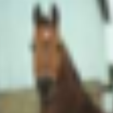|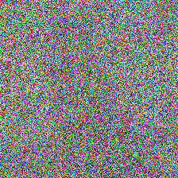|
|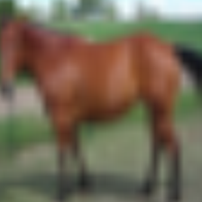|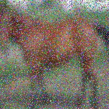|
|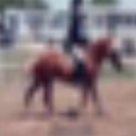|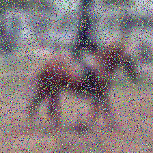|
|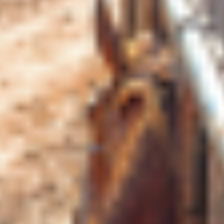|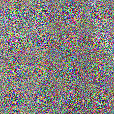|
|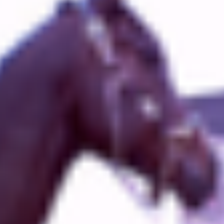|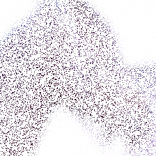|


All in all, I tried 10 of these in varying styles. It did great with being not too different, not once did it say `"TOO DIFFERENT"`. Which is wild, because most of them just looked like confettivision in the end. Similarly, the Nonrobust hardly ever called it a horse, which is a plus. However, most of the time, Robust didn't call it a horse either. In fact, I was only able to get 1 of the 10 I tried to successfully submit. So we're on the right track.

Another problem with this method is the speed. It takes around 15 seconds per image processing, which isn't short enough, let alone click-to-download, click-to-upload, etc.

### The Goldilocks Mask

It's time to pull out the model they gave us. If we can change the image just enough that Nonrobust thinks it's not a horse, with any luck, Robust will still think it is.

We're going to borrow a lot more from `web.py`, mostly how the model guesses what the image is. Most of it is plug-and-play, but I'm going to change `get_prediction()` just a bit, so I can pass in the pre-calculated `hash_orig` instead of re-calculating it every time (and, more honestly, figuring out how to pass the image back in as a b64 string).

This version modifies the image 5 random pixels at a time, checks to see if we've modified it too far, and checks to see if Nonrobust still thinks it's a horse. If it is modified too far, we simply reset. Once the model no longer thinks it's a horse, we save the file, and we're done.

```python
from PIL import Image, ImageDraw
import io
import os
import sys
import random
import imagehash
from torchvision import models
import torchvision.transforms as transforms
import torch.nn as nn
import torch


HASH_DIFFERENCE = 5 # how different the imagehash is

# if len(sys.argv) < 2:
#     print('give arg')
#     exit()

filename = "./index.png"


imagenet_class_index = ['plane', 'car', 'bird', 'cat', 'deer', 'dog', 'frog', 'horse', 'ship', 'truck']
device = torch.device("cuda:0" if torch.cuda.is_available() else "cpu")

def transform_image(image_bytes):
    my_transforms = transforms.Compose([
                        transforms.ToTensor(),
                        transforms.Normalize(
                            [0.485, 0.456, 0.406],
                            [0.229, 0.224, 0.225])])
    image = Image.open(io.BytesIO(image_bytes))
    return my_transforms(image).unsqueeze(0)

def get_prediction(image_bytes, model, hash_orig):
    inputs = transform_image(image_bytes=image_bytes)
    outputs = model(inputs)
    preds = torch.argmax(outputs, 1)
    # original = curr_image

    # "where the magic happens" - akshunna
    input_image = Image.open(io.BytesIO(image_bytes))
    # hash_orig = imagehash.average_hash(original)
    hash_input = imagehash.average_hash(input_image)

        # currently HASH_DIFFERENCE is 5
        # is number of bits changed in the hash
        # hash is 64 bits long
        # up to 5 hex digits can be different
        # 16 hex digits
        # 256b hash
        # 0xffff ffff ffff ffff ffff ffff ffff ffff
    if hash_orig - hash_input < HASH_DIFFERENCE:
        return imagenet_class_index[preds]
    else:
        return "IMAGE WAS TOO DIFFERENT"


original = Image.open(os.path.expanduser(filename))
hash_orig = imagehash.average_hash(original)

modified = Image.open(os.path.expanduser(filename))
# old_modified = Image.open(os.path.expanduser(sys.argv[1]))

draw_mod = ImageDraw.Draw(modified)
# draw_old_mod = ImageDraw.Draw(old_modified)

model_nonrobust = models.resnet18()
num_ftrs = model_nonrobust.fc.in_features
model_nonrobust.fc = nn.Linear(num_ftrs, len(imagenet_class_index))
model_nonrobust.load_state_dict(torch.load("./models/pwny_cifar_eps_0.pth", map_location = device))
model_ft = model_nonrobust.to(device)
model_nonrobust.eval()

while True:
    for _ in range(5):
        position = random.randint(0, 224), random.randint(0, 224)
        color = random.randint(0, 255), random.randint(0, 255), random.randint(0, 255)
        draw_mod.line([position, position], fill=color)

    img_byte_arr = io.BytesIO()
    modified.save(img_byte_arr, format='PNG')

    nonrobust = get_prediction(image_bytes=img_byte_arr.getvalue(), model=model_nonrobust, hash_orig=hash_orig)
    # print(nonrobust)
    if nonrobust == "IMAGE WAS TOO DIFFERENT":
        modified = Image.open(os.path.expanduser(filename))
        draw_mod = ImageDraw.Draw(modified)
        continue
    if nonrobust != 'horse':
        break

modified.save(os.path.expanduser(filename.replace('index', 'pwn')))
```

|Image given               |Image with mask         |
|--------------------------|------------------------|
||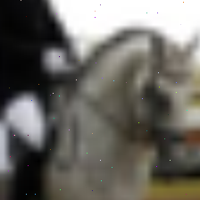|
||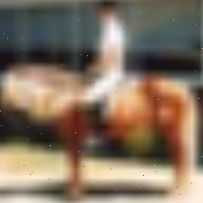|
||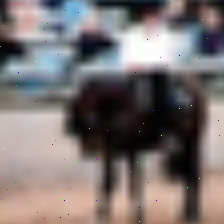|

This way works! It runs in about 2 seconds every picture, it's never `"TOO DIFFERENT"`, and Nonrobust _never_ thinks it's a horse, which means the _only_ problem we'll run into is if Robust also doesn't think its a horse. In fact, that happens reliably infrequently. I only ever noticed one mistake.

However, we run into another problem: mouse speed. As fast as I could manage, split-screen full-hack-track-pad game strong, I could only manage sneaking 35 pwnies past the bouncer. This isn't fast enough.

### Automating Everything

Our algorithm works great, we just need to automate downloading and uploading images. Enter Requests.

```python
# myses.py
#
# We'll use this file simply to keep track of the session cookie we get from the browser.
session = 'f82cdd1c8bd034ae_610c2972.SBuQOvmbpULghEpcgh2cXuHS3yE'
```

```python
import requests
import re
import base64
from PIL import Image, ImageDraw
import io
import os
import sys
import random
import imagehash
from torchvision import models
import torchvision.transforms as transforms
import torch.nn as nn
import torch
import myses # Helper file imported here

url = 'http://pwnies-please.chal.uiuc.tf/?'
jar = requests.cookies.RequestsCookieJar()
jar.set('session', myses.session, domain='pwnies-please.chal.uiuc.tf', path='/')

imagenet_class_index = ['plane', 'car', 'bird', 'cat', 'deer', 'dog', 'frog', 'horse', 'ship', 'truck']
device = torch.device("cuda:0" if torch.cuda.is_available() else "cpu")

model_nonrobust = models.resnet18()
num_ftrs = model_nonrobust.fc.in_features
model_nonrobust.fc = nn.Linear(num_ftrs, len(imagenet_class_index))
model_nonrobust.load_state_dict(torch.load("./models/pwny_cifar_eps_0.pth", map_location = device))
model_ft = model_nonrobust.to(device)
model_nonrobust.eval()

def transform_image(image_bytes):
    my_transforms = transforms.Compose([
                        transforms.ToTensor(),
                        transforms.Normalize(
                            [0.485, 0.456, 0.406],
                            [0.229, 0.224, 0.225])])
    image = Image.open(io.BytesIO(image_bytes))
    return my_transforms(image).unsqueeze(0)

def get_prediction(image_bytes, model, hash_orig):
    inputs = transform_image(image_bytes=image_bytes)
    outputs = model(inputs)
    preds = torch.argmax(outputs, 1)
    # original = curr_image

    # "where the magic happens" - akshunna
    input_image = Image.open(io.BytesIO(image_bytes))
    # hash_orig = imagehash.average_hash(original)
    hash_input = imagehash.average_hash(input_image)

        # currently HASH_DIFFERENCE is 5
        # is number of bits changed in the hash
        # hash is 64 bits long
        # up to 5 hex digits can be different
        # 16 hex digits
        # 256b hash
        # 0xffff ffff ffff ffff ffff ffff ffff ffff
    if hash_orig - hash_input < HASH_DIFFERENCE:
        return imagenet_class_index[preds]
    else:
        return "IMAGE WAS TOO DIFFERENT"

for i in range(54): # 50 pwnies plus margin
    print(i)

    r = requests.get(url, cookies=jar) # website
    img = re.search(r'img class="show" src="([^"]*)"', r.text).group(1)

    with open('./index.png', 'wb') as outf:
        outf.write(base64.b64decode(img[22:]))

    HASH_DIFFERENCE = 5 # how different the imagehash is

    filename = "./index.png"

    original = Image.open(filename)
    hash_orig = imagehash.average_hash(original)

    modified = Image.open(filename)

    draw_mod = ImageDraw.Draw(modified)

    while True:
        for _ in range(5):
            position = random.randint(0, 224), random.randint(0, 224)
            color = random.randint(0, 255), random.randint(0, 255), random.randint(0, 255)
            draw_mod.line([position, position], fill=color)

        img_byte_arr = io.BytesIO()
        modified.save(img_byte_arr, format='PNG')

        nonrobust = get_prediction(image_bytes=img_byte_arr.getvalue(), model=model_nonrobust, hash_orig=hash_orig)
        # print(nonrobust)
        if nonrobust == "IMAGE WAS TOO DIFFERENT":
            modified = Image.open(os.path.expanduser(filename))
            draw_mod = ImageDraw.Draw(modified)
            continue
        if nonrobust != 'horse':
            break

    modified.save(filename.replace('index', 'pwn'))

    response = requests.post(url, files={'file': open(filename.replace('index', 'pwn'), 'rb')}, cookies=jar)
```

After 50 ponies and before our 5 minute timer is up, we refresh the page, and the status line shows us a flag.

## Real-World Application

This challenge gives us some insight into the fallability of machine learning models. It is very intriguing to see how some random dots can change a machine learning model from thinking an image is a horse to thinking it's a frog. We also get some small image-drawing practice, as well as image-loading. We have a little exposure to web requests in Python, with the use of cookies and file uploads.