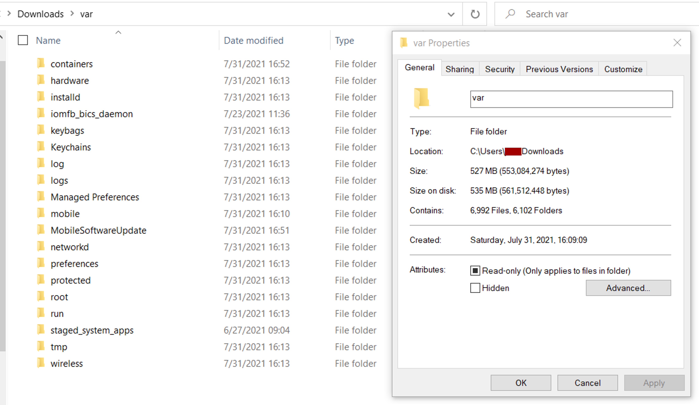
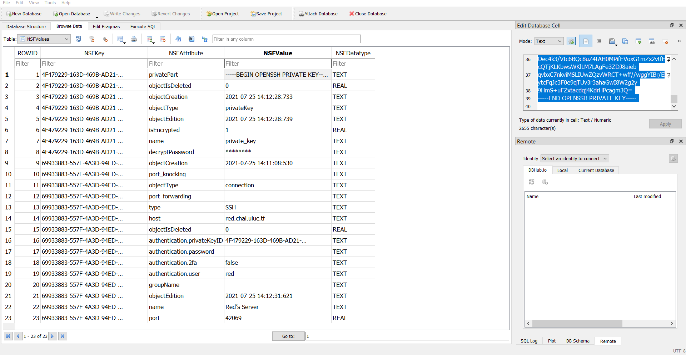
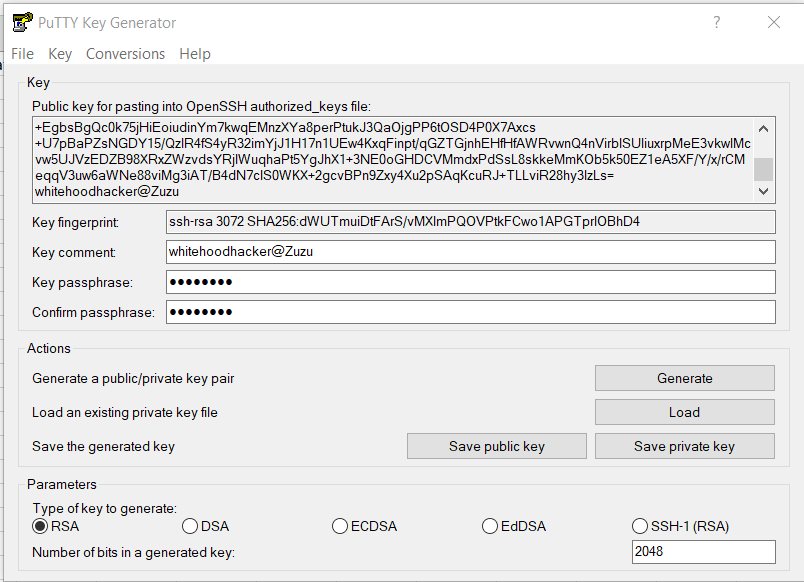
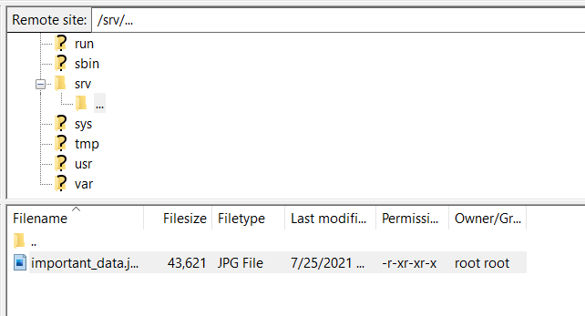

# UIUCTF 2021 - Tablet 1 Writeup
* Type - Forensics
* Name - Tablet 1
* Points - 103

## Description
```
Red has been acting very sus lately... so I took a backup of their tablet to see if they are hiding something!

It looks like Red has been exfiltrating sensitive data bound for Mira HQ to their own private server. We need 
to access that server and contain the leak.

NOTE: Both Tablet challenges use the same tablet.tar.gz file.

Google Drive mirror
Dropbox mirror
MEGA mirror
MD5: f629eec128551cfd69a906e7a29dc162

author: WhiteHoodHacker
```

## Writeup
The two tags that the creator included for this challenge were `forensics` and `iPadOS`, so I knew this would be a mobile forensics challenge. I've only used Autopsy in the past for forensics, so I decided to put the files through it's algorithms and see what it finds. [Autopsy](https://www.autopsy.com/) is a widely-used, open-source forensics platform that analyzes disk images, memory, file systems, and others. It runs a series of specialized modules to pull out pertinent information and display the most important stuff first. 



The three mirrors that were included in the description downloaded a .tar.gz file of the entire filesystem of an iPad. Upon first inspection, there was a half GB of total data with over 6000 files and folders. I opened a new case in Autopsy and ran all the modules on it. Unfortunately, the iOS Analyzer didn't highlight anything useful, except the location for a Discord cookie. This ended up being useful for the second tablet challenge. 

The cookie was stored at `/mobile/Containers/Data/Application/0CE5D539-F72A-4C22-BADF-A02CE5A50D2E/Library/Cookies/`, but was the only thing inside. I looked around a little more but didn't quite find anything particularly useful. 

I went back to the base directory and found the `/root/.bash_history` file - I figured if I knew what commands root ran, I'd know where to start looking:

```
ls
exit
tar --version
exit
cd ../mobile/Containers/Data/Application/
find ./ -iname *hammerandchisel* -type d 2>/dev/null
cd 0CE5D539-F72A-4C22-BADF-A02CE5A50D2E/
ls
cd Library/
ls
cd Caches/
ls
cd com.hammerandchisel.discord/
ls
rm -rf *
ls
cd ..
ls
ls
cd com.hammerandchisel.discord/
ls
exit
cd ../mobile/Containers/Data/Application/AA7DB282-D12B-4FB1-8DD2-F5FEF3E3198B/Library/Application\ Support/
rm webssh.db 
exit
```

This bash history file had two commands listed at the bottom that caught my eye:

```
cd ../mobile/Containers/Data/Application/AA7DB282-D12B-4FB1-8DD2-F5FEF3E3198B/Library/Application\ Support/
rm webssh.db 
```



I opened up the webssh.db file in [DB Browser for SQLite](https://sqlitebrowser.org/) as pictured above and found all the details I needed to connect to Red's server. The username, host, port, private key, and decryption passkey were all included in one nice, little, tidy file for me to use. I copied the private key into a .pem file, but found that since it was an OpenSSH private key and not RSA, I couldn't use it through the SSH command line interface. 



After a little research on the interwebs, I learned that it was commonly used in PuTTY - so I opened up Puttygen, loaded the key, and inserted the decryption password (side note - the password shown was `********`, so I figured it was redacted and would have to brute force it. However, I tried the 8 asterisks anyway for funzies and it worked! So that was legitimately the decrypt password). I then downloaded the private key as a .PPK file, put that into the regular PuTTY console interface, and signed into `red.chal.uiuc.tf` as red.

This is when I ran into my 14th problem of the day - the session kept closing suddenly. I told PuTTY to not close the session unless I told it to, and when I tried to log in again, it said it could only be used with SFTP - FTP over SSH. I used [FileZilla](https://filezilla-project.org/), an open-source solution that supports FTP, SFTP, and FTPS. I added in all the credentials as needed, specified the protocol as SFTP, and successfully logged in. It placed me in the `/home/red/` folder, where I found another `.bash_history` file. This file only had one line:

```
mv /srv/exfiltrated "/srv/..."
```



I went to that directory and found one file - important_data.jpg. I uploaded that photo to my own computer and found the flag inside!


**Flag:** `uiuctf{upload_task_only_takes_9_seconds_0bf79b}`

## Real-World Application
Mobile forensics is becoming a *huge* part of today's world; in fact, [Forensic Focus says](https://www.forensicfocus.com/news/the-dos-and-donts-of-mobile-forensics/) that "more than 90% of criminal cases today involve mobile devices as their main source of evidence"! This was definitely my first time dealing with mobile device forensics, and I learned a lot! It's important to understand that normal desktop-focused forensics tools and techniques aren't as effective (or just don't work) with mobile devices as they are set up completely different. When I ran all the Autopsy modules on the file system I got for this challenge, I got hardly any results, so I used intuition and grep a lot. I'm now going to look into mobile device forensics more and see if I can find open-source tools and guides to help me in future challenges like this. 

Something else I learned and that is important to know is different types of SSH keys - I ended up finding an OpenSSH key, which doesn't work in normal SSH CLI settings. I had to use it with PuTTY just to sign in to the server - and ended up figuring out it was SFTP anyway!