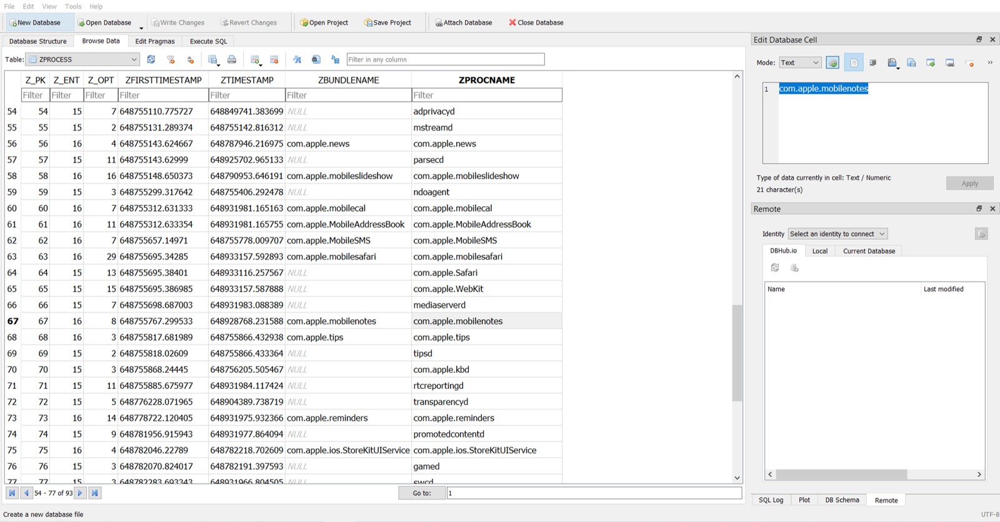
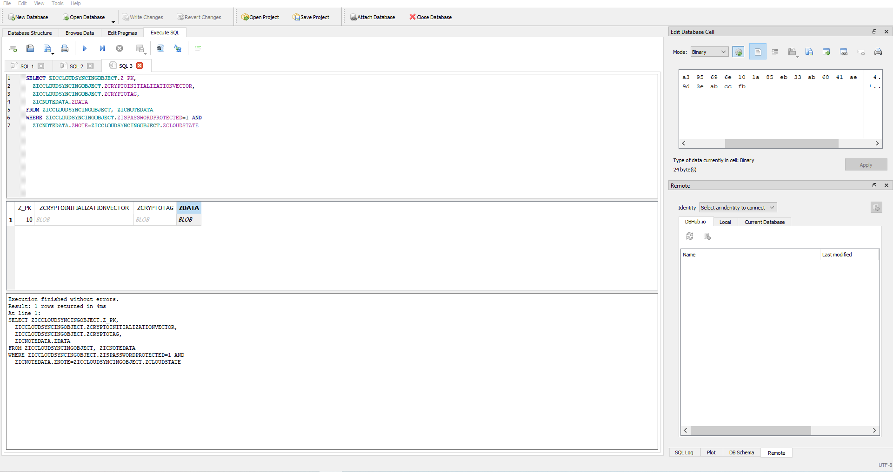
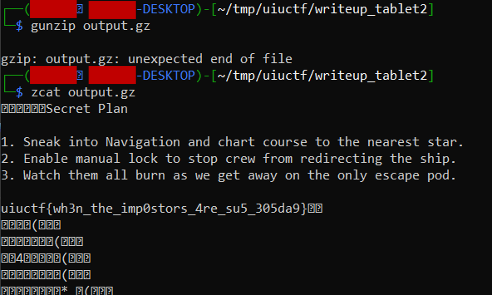

# UIUCTF 2021 - Tablet 2 Writeup
* Type - Forensics
* Name - Tablet 2
* Points - 197

## Description
```
Wait... there are TWO impostors?! Red must have been in contact with the other impostor. See 
if you can find out what they are plotting.

NOTE: Both Tablet challenges use the same file, which can be downloaded from Tablet 1.

author: WhiteHoodHacker
```

## Writeup
With only 2 hours left in the competition, I decided to try my luck on this challenge. While doing Tablet 1, I navigated to the `/root/` directory and opened the `.bash_history` file:

```
ls
exit
tar --version
exit
cd ../mobile/Containers/Data/Application/
find ./ -iname *hammerandchisel* -type d 2>/dev/null
cd 0CE5D539-F72A-4C22-BADF-A02CE5A50D2E/
ls
cd Library/
ls
cd Caches/
ls
cd com.hammerandchisel.discord/
ls
rm -rf *
ls
cd ..
ls
ls
cd com.hammerandchisel.discord/
ls
exit
cd ../mobile/Containers/Data/Application/AA7DB282-D12B-4FB1-8DD2-F5FEF3E3198B/Library/Application\ Support/
rm webssh.db 
exit
```

One of my teammates mentioned he found a password in Discord messages but nothing else, so I knew he was on the right track. I went to the /mobile/Containers/Data/Application/0CE5D539-F72A-4C22-BADF-A02CE5A50D2E/Library/Caches/com.hammerandchisel.discord/ and opened the cache.db file using [DB Browser for SQLite](https://sqlitebrowser.org/). One of the tables was `cfurl_cache_receiver_data_`, and it included a transcription of the conversation between Red and Blue. It also hinted the existence of an encrypted note, but nothing as to where it was or how they sent the note.


The last text sent was `The password is ||su5Syb@k4||`. We had the password, we now needed to get the note. While solving Tablet 1, I put the entire filesystem they gave us into Autopsy, and one of the results included a list of all the database files found. As I was scrolling through that list, `netusage.db` caught my eye - Red had to receive the note from Blue over the Internet in *SOME* form, so maybe looking at network usage logs would help me figure out how. I opened up `netusage.db` in DB Browser again, and was looking through all sorts of applications when apple.mobilenotes stood out to me. 



My first thought was, "It can't be Apple Notes. No one *ever* uses the default application for stuff like that! Could they really??" Idk, maybe it's just cause I have an Android \o/. Regardless, I did some Googling and came across a [tutorial for decrypting iOS notes](https://cyberforensicator.com/2018/10/01/using-hashcat-to-decrypt-ios-notes-for-cellebrites-physical-analyzer/). While this was intended for brute forcing the password to notes and used a commercial version of software I didn't have, I still was able to locate `NoteStore.sqlite` which held the encrypted note. 

I opened up NoteStore.sqlite in DB Browser and realized that one of the notes was titled "Secret Plan" - so they *DID* use Apple Notes! What a shame! 

### Decrypting the Note
At this point, I only had 45 minutes left until the competition closed, so I knew I needed to work fast! The last task was to take this NoteStore.sqlite file and the password and decrypt the note, giving us (hopefully) the flag. Doing some further research led me to [a tutorial on decrypting Apple Notes](https://ciofecaforensics.com/2020/07/31/apple-notes-revisited-encrypted-notes/) in Ruby. I had never used Ruby before, but he gave us all the code, so I knew I just needed to plug-and-play. 



The process to decrypt Apple notes was 3 fold - deriving the password-based key, unwrapping the decryption key, and finally decrypting the data. For each step, I used the SQL queries outlined to extract the data needed for that step. I then put the code into a file called crack.rb and replaced their data with the SQL output. After installed the aes_key_wrap library, I had 3 minutes left until UIUCTF closed and I was **STRESSED**! I ran the code, only to get an error! I wasn't sure what had happened, so I tried to the password without the pipes (`||`), and only got gibberish. :( 

Defeated, I started trying to debug my code, knowing I had just run out of time. Much to my surprise and anger, I revisited the problem a few days later because I knew I was close and realized what my mistake was. I was expected the output to be plaintext, but the same tutorial I had used mentioned that a Gzip file was outputted. I checked the magic bytes, and sure enough, when I omitted the pipes, the "gibberish" was actually a Gzip file! 



I tried using `gunzip` to extract the data, but it gave me an EOL error. A quick Google search told me `zcat` could do the same, and so after running `zcat`, I got the flag!

**Flag:** `uiuctf{wh3n_the_imp0sters_4re_su5_305da9}`

## Real-World Application
I think the real-world application for this problem closely echoes that of Tablet 1's - mobile forensics. This was a good experience for me to get started in mobile forensics because it's a huge part of today's world! There's probably another tool out there for extracted encrypted iOS mobile notes, but I very much enjoyed the process of doing it using a Ruby script. This comes to show that if you send a password in plaintext (like Blue did), you're negating the very purpose of the password. While it takes more time for the attacker to extract your data, it will never stop them.