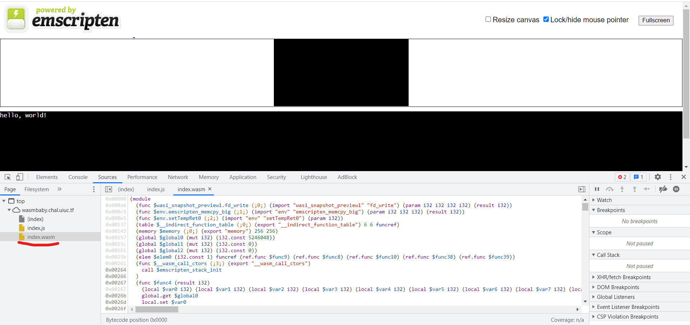
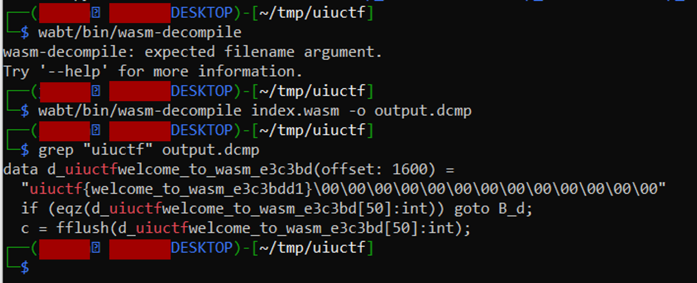

# Wasmbaby (Beginner)
* Type - Web
* Name - Wasmbaby
* Points - 50

## Description
```
wasm's a cool new technology! http://wasmbaby.chal.uiuc.tf

author: ian5v
```

## Writeup
"Wasm" stands for [WebAssembly](https://developer.mozilla.org/en-US/docs/WebAssembly), a low-level language that allows you to run non-web files on a web browser. For example, if you wanted to run a C++ or Rust file in your web browser, you can convert it into WebAssembly and integrate it into your website through JavaScript. More details about WebAssembly can be found [here](https://webassembly.org/). 



To download a wasm file for local editing, you can open the console, go to Sources, and you'll find the .wasm file. If you right click on the underlined portion shown above and select "Open in a New Tab", it will download the .wasm file for you since it can't properly display it by itself in the browser. 

Now that we have this binary file, we want to convert it to a more readable format so we can understand what it's supposed to do. There's a GitHub repository that WebAssembly maintains called [WebAssembly Binary Toolkit](https://github.com/WebAssembly/wabt) that allows you to convert and manipulate WebAssembly files. I cloned the repository and went through the steps described to install all the files. `wasm-decompile` is a program that turns a .wasm file into a much more readable format. I used the commands below to turn index.wasm into a .dcmp file. 



I then used grep to see if the flag was in plaintext, which it was! Luckily, I didn't have to go and inspect the program any closer!

**Flag:** `uiuctf{welcome_to_wasm_e3c3bdd1}`